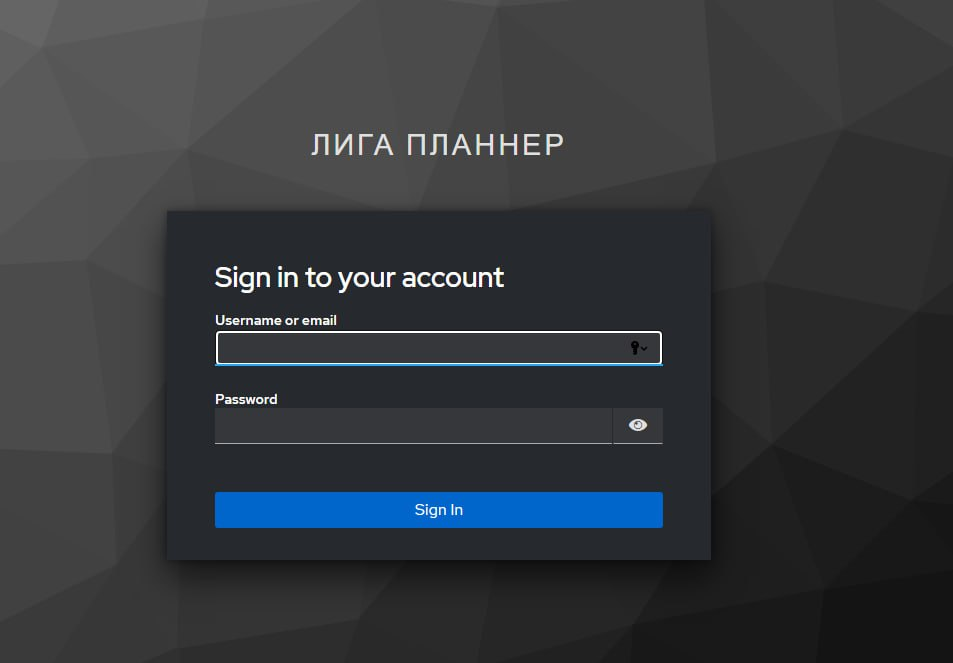

# Экран входа (Keycloak)

Форма аутентификации пользователя при первом переходе в систему.

## Элементы формы

| Поле | Тип | Обязательность | Условие отображения | Комментарий |
| --- | --- | --- | --- | --- |
| Username or email | input | да | всегда | Логин пользователя |
| Password | input | да | всегда | Пароль |
| Sign In | button | да | всегда | Подтверждение входа |

## Связанные материалы

- [Use Case: Аутентификация](../../Use-cases/Аутентификация/аутентификация.md)
