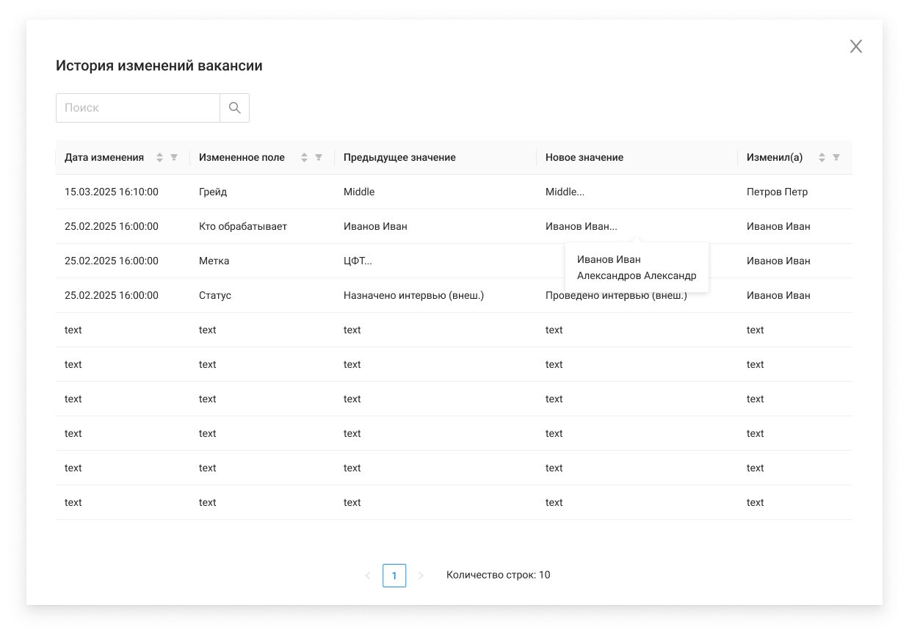

# История изменений вакансии

| --- |
|  |

#### Экранная форма

##### История изменений

При открытии выполняется дефолтная сортировка по дате изменения (сначала последние изменения)

| Название элемента | Формат | Доступность | Обязательность | Input / Output | Описание / Комментарий |
| --- | --- | --- | --- | --- | --- |
| Поиск | Search | FA | - | - | Поиск по истории изменений |
| Дата изменения | Text | RO | Да | updatedAt | Отображает информацию о дате изменения |
| Измененное поле | Text | RO | Да | changedField | Отображает информацию, какое поле было изменено |
| Предыдущее значение | Text | RO | Да | previousValue | Отображает информацию о предыдущем значении измененного поля / Для полей "Грейд", "Кто обрабатывает", "Метка": если содержит несколько значений, то при наведении на ячейку всплывает Popover со всеми значениями, иначе Popover не всплывает |
| Новое значение | Text | RO | Да | newValue | Отображает информацию о новом значении измененного поля / Для полей "Грейд", "Кто обрабатывает", "Метка": если содержит несколько значений, то при наведении на ячейку всплывает Popover со всеми значениями, иначе Popover не всплывает / Парсинг полей: / если fieldDataType = "ARRAY_STRING", то строку преобразовываем в массив строк (разделитель** ;** ) / если fieldDataType = "DATE", то строку преобразовываем в дату |
| Изменил(а) | Text | RO | Да | updatedBy | Отображает информацию о том, кто внес изменения (Фамилия Имя) |
| Сортировка | Icon-sort | FA | - | - | По умолчанию строки отсортированы от новых к старым по дате изменения |
| Фильтрация | Icon-filter | FA | - | - |  |
| Количество строк | Text | RO | - | - |  |
| Пагинация | Pagination | RO (FA если больше 1 страницы) | - | - |  |
