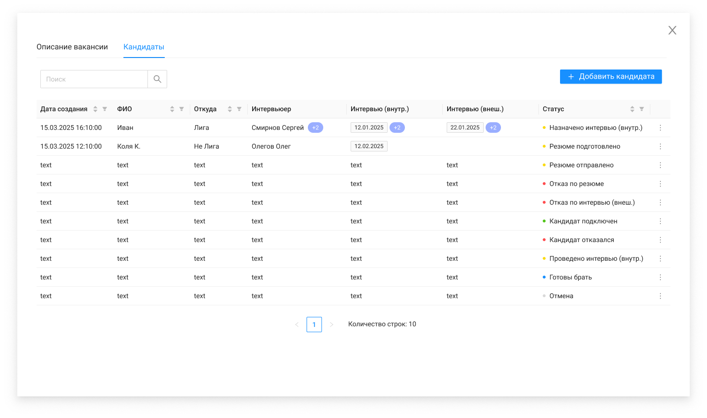

# Кандидаты в вакансии

При открытии вкладки "Кандидаты" карточки вакансии:
вызывается метод GET /management/candidates?vacancyId={vacancyId}
выполняется сортировка по умолчанию по полям "createdAt" и "updatedAt": сначала идут новые записи, ниже более старые
По двойному нажатию на строку вызывается метод GET /management/candidates/{id}, открывается ЭФ

| Название элемента | Формат | Доступность | Обязательность | Input / Output | Описание / Комментарий |
| --- | --- | --- | --- | --- | --- |
| Описание вакансии | Tab | FA | - | - | По нажатию переключается на вкладку Описание вакансии |
| Кандидаты | Tab | RO (FA если открыта вкладка Описание вакансии) | - | - | Выделяется активным цветом, когда открыт список кандидатов на вакансию / Если открыта вкладка Описание вакансии - по нажатию переключается на вкладку Кандидаты |
| Поиск | Search | FA | - | - | Поиск по списку кандидатов на вакансию |
| Дата создания | Text | RO | Да | createdAt | Отображает дату создания кандидата |
| ФИО | Text | RO | Да | fullName | Отображает информацию из поля "ФИО" карточки кандидата |
| Откуда | Text | RO | Да | wherefrom | Отображает информацию из поля "Откуда" карточки кандидата |
| Интервьюер | Text | RO | Нет | **interviewers:** / lastName + firstName | Отображает информацию из поля "Интервьюер" карточки кандидата |
| Интервью (внутр.) | Tag | RO | Нет | **interviews:** / date + type | Отображает информацию из поля "Интервью (внутр.)" карточки кандидата (type = INTERNAL) |
| Интервью (внеш.) | Tag | RO | Нет | **interviews:** / date + type | Отображает информацию из поля "Интервью (внеш.)" карточки кандидата (type = EXTERNAL) |
| Статус | Text | RO | Да | status | Отображает информацию из поля "Статус" карточки кандидата |
| Сортировка | Icon-sort | FA | - | - | По нажатию сортирует столбец по убыванию/возрастанию, если открыта страница > 1, то возвращает пользователя на 1 страницу с применением сортировки / Если активна сортировка по одному столбцу, то при выборе сортировки по другому столбцу предыдущая сортировка отменяется, и применяется сортировка только по новому выбранному столбцу |
| Фильтрация | Icon-filter | FA | - | - |  |
|  | Menu | FA | - | - | По наведению раскрывает меню с выбором действий: / Редактировать (по нажатию: вызывает метод GET /management/employees, открывает ЭФ редактирования карточки кандидата) / Сменить статус (по нажатию открывает pop-up с полем выбора статуса) |
| Количество строк | Text | RO | - | - |  |
| Пагинация | Pagination | RO (FA если больше 1 страницы) | - | - |  |
| Добавить кандидата | Button | FA | - | - | По нажатию: / вызывает метод GET /management/employees / открывает ЭФ создания карточки кандидата |
