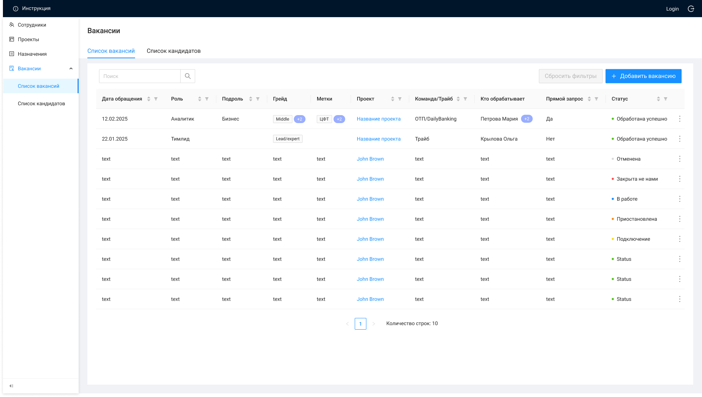

# Список вакансий

При открытии ЭФ "Список вакансий":
вызывается метод GET /management/vacancies
выполняется сортировка по умолчанию по полям "createdAt" и "updatedAt": сначала идут новые записи, ниже более старые
По двойному нажатию на строку вызывается метод GET /management/vacancies/{id}, открывается ЭФ

| Название элемента | Формат | Доступность | Обязательность | Input / Output | Описание / Комментарий |
| --- | --- | --- | --- | --- | --- |
| **Header** | **Header** | **Header** | **Header** | **Header** | **Header** |
| Инструкция | Button | FA | - | - | По нажатию открывает страницу |
| Выход из системы | Button | FA | - | - | По нажатию выходит из системы (завершение сеанса пользователя) |
| Login | Text | RO | Да | preferred_username | Отображает логин пользователя под которым он зашел в систему |
| **Main** | **Main** | **Main** | **Main** | **Main** | **Main** |
| Список вакансий | Tab | RO (FA если открыт Список кандидатов) | - | - | Выделяется активным цветом, когда открыта страница списка вакансий / Если открыта страница списка кандидатов - по нажатию отображает страницу списка вакансий |
| Список кандидатов | Tab | FA | - | - | По нажатию отображает страницу списка кандидатов |
| Добавить вакансию | Button | FA | - | - | По нажатию: / вызывает метод GET /management/roles / вызывает метод GET /management/employees / вызывает метод GET /management/projects / открывает ЭФ |
| Сбросить фильтры | Button | RO (FA если применена фильтрация) | - | - | По нажатию сбрасывает все примененные фильтры / Неактивна, если нет примененных фильтров |
| Поиск | Search | FA | - | - | Поиск по списку вакансий |
| Дата обращения | Text | RO | Да | dateOfRequest | Отображает информацию из поля "Дата обращения" карточки вакансии |
| Роль | Text | RO | Да | **role:** / name | Отображает информацию из поля "Роль" карточки вакансии |
| Подроль | Text | RO | Нет | **subrole:** / name | Отображает информацию из поля "Подроль" карточки вакансии |
| Грейд | Text | RO | Да | grade | Отображает информацию из поля "Грейд" карточки вакансии |
| Метка Метки |  | RO | Нет | tags | Отображает информацию из поля  "Метка" "Метки" карточки вакансии |
| Проект | Text | FA | Да | **project:** / name | Отображает информацию из поля "Проект" карточки вакансии, по нажатию на текст вызывается метод GET /management/projects/{id}, открывается ЭФ просмотра карточки проекта |
| Команда/Трайб | Text | RO | Нет | tribe | Отображает информацию из поля "Команда/Трайб" карточки вакансии |
| Кто обрабатывает | Text | RO | Да | **processesBy:** / lastName + firstName | Отображает информацию из поля "Кто обрабатывает" карточки вакансии в формате Фамилия + Имя |
| Прямой запрос | Text | RO | Да | isDirect | Отображает информацию из поля "Прямой запрос" карточки вакансии |
| Статус | Text | RO | Да Закрепленный столбец | status | Отображает информацию из поля "Статус" карточки вакансии |
| Сортировка | Icon-sort | FA | - | - | По нажатию сортирует столбец по убыванию/возрастанию, если открыта страница > 1, то возвращает пользователя на 1 страницу с применением сортировки / Приоритет столбцов при ручной комбинированной сортировке: / Статус / Проект / Команда/Трайб / Роль / Подроль / Дата обращения / Прямой запрос |
| Фильтрация | Icon-filter | FA | - | - |  |
|  | Menu | FA | - | - | По наведению раскрывает меню с выбором действий: / Редактировать (по нажатию: вызывает методы GET /management/vacancies/{id}, GET /management/roles, GET /management/employees, GET /management/projects; открывает ЭФ ) / Сменить статус (по нажатию открывает pop-up с полем выбора статуса) |
| Количество строк | Text | RO | - | - |  |
| Пагинация | Pagination | RO (FA если больше 1 страницы) | - | - |  |
