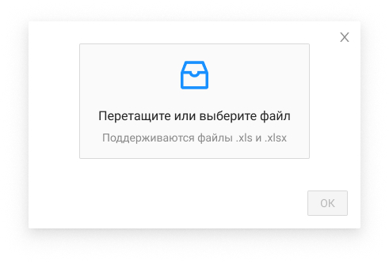

# Импорт вопросов-ответов

| Название элемента | Формат | Доступность | Обязательность | Input / Output | Описание / Комментарий |
| --- | --- | --- | --- | --- | --- |
| Область для выбора файла | Upload drag | FA | - | - | Выбор файла для загрузки: / перетаскивание в выделенную область / по нажатию / По нажатию открывает проводник системы с возможностью выбора одного файла для загрузки / При повторном выборе происходит замена выбранного файла / Загруженный файл отображается под областью, при наведении напротив файла появляется иконка , по нажатию на нее отменяется прикрепление файла / Максимальный размер файла - 10 МБ. Максимальная длина названия файла - 30 символов. Допустимые форматы для загрузки: .xlsx, .xls / **Валидации:** / при загрузке файла выполняется проверка размера, если размер больше 10 МБ, то загрузка прерывается и выводится окно с ошибкой "Размер файла превышает допустимый лимит 10 МБ" / при загрузке файла выполняется проверка формата, если формат не является одним из допустимых, то загрузка прерывается и выводится окно с ошибкой "Недопустимый формат файла. Разрешены файлы формата .xlsx, .xls" / при загрузке файла выполняется проверка длины названия, если длина названия больше 30 символов, то загрузка прерывается и выводится окно с ошибкой "Название файла превышает допустимую длину в 30 символов" |
| ОК | Button | RO (FA после успешного выбора файла) | - | - | Неактивна, если не был успешно выбран файл / По нажатию вызывается метод PUT /management/candidates/{candidateId}/interview-results, который сохраняет данные из выбранного файла в БД и закрывает pop-up |
