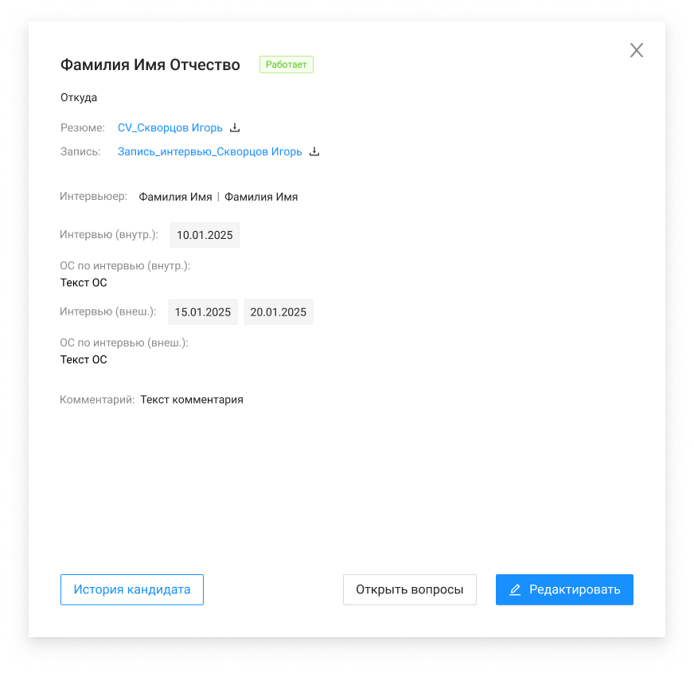

# Карточка кандидата

Первая версия

Вторая версия

| Название элемента | Формат | Доступность | Обязательность | Input / Output | Описание / Комментарий |
| --- | --- | --- | --- | --- | --- |
| Фамилия Имя Отчество | Text | RO | Да | fullName | Отображает информацию из поля "ФИО" |
| Статус | Tag | RO | Да | status | Отображает информацию из поля "Статус" |
| Откуда | Text | RO | Да | wherefrom | Отображает информацию из поля "Откуда" |
| Резюме | Text | FA | Нет | **file:** / name + link | Отображает название файла в виде кликабельной ссылки на скачивание. По нажатию начинает скачивание файла-резюме / Если значение null, то не отображается |
| Сконвертировать резюме | Button | FA | Да | file | При нажатии на кнопку открывается окно для выбора файла.  Загрузить можно только один файл После загрузки файла и ответа метода POST /management/candidates/{candidateId}/resume/convert, кнопка скрывается и отображается поле "Сконвертированное резюме" |
| Сконвертированное резюме | Text | FA | Нет | **file:** / name + link | Отображает название файла в виде кликабельной ссылки на скачивание. По нажатию начинает скачивание файла-резюме / Если значение null, то не отображается |
| Запись | Text | FA | Нет | **audio:** / name + link | Отображает название записи в виде кликабельной ссылки на скачивание. По нажатию начинает скачивание аудио записи / Если значение null, то не отображается |
| Интервьюер | Text | RO | Нет | **interviewers:** / lastName + firstName | Отображает информацию из поля "Интервьюер" / Если указано несколько значений, то они отображаются через символ "\|" с помощью парсинга / Если значение null, то не отображается |
| Интервью (внутр.) | Tag | RO | Нет | **interviews****:** / date + type | Отображает информацию из поля "Дата интервью (внутр.)" (type = INTERNAL) / Если значение null, то не отображается |
| ОС по интервью (внутр.) | Text | RO | Нет | screeningFeedback | Отображает информацию из поля "ОС по интервью (внутр.)" (type = EXTERNAL) / Если значение null, то не отображается |
| Интервью (внеш.) | Tag | RO | Нет | **interviews****:** / date + type | Отображает информацию из поля "Дата интервью (внеш.)" / Если значение null, то не отображается |
| ОС по интервью (внеш.) | Text | RO | Нет | customerFeedback | Отображает информацию из поля "ОС по интервью (внеш.)" / Если значение null, то не отображается |
| Комментарий | Text | RO | Нет | comment | Отображает информацию из поля "Комментарий" / Если значение null, то не отображается |
| Редактировать | Button | FA | - | - | По нажатию: / вызывает метод GET /management/employees / открывает ЭФ |
| Открыть вопросы | Button | FA | - | - | По нажатию: / вызывается метод GET /management/candidates/{id}/results-interview / открывается ЭФ |
| История кандидата | Button | FA | - | - | По нажатию вызывает метод GET /management/candidates/{candidateId}/history, открывает ЭФ просмотра истории изменений по кандидату |
