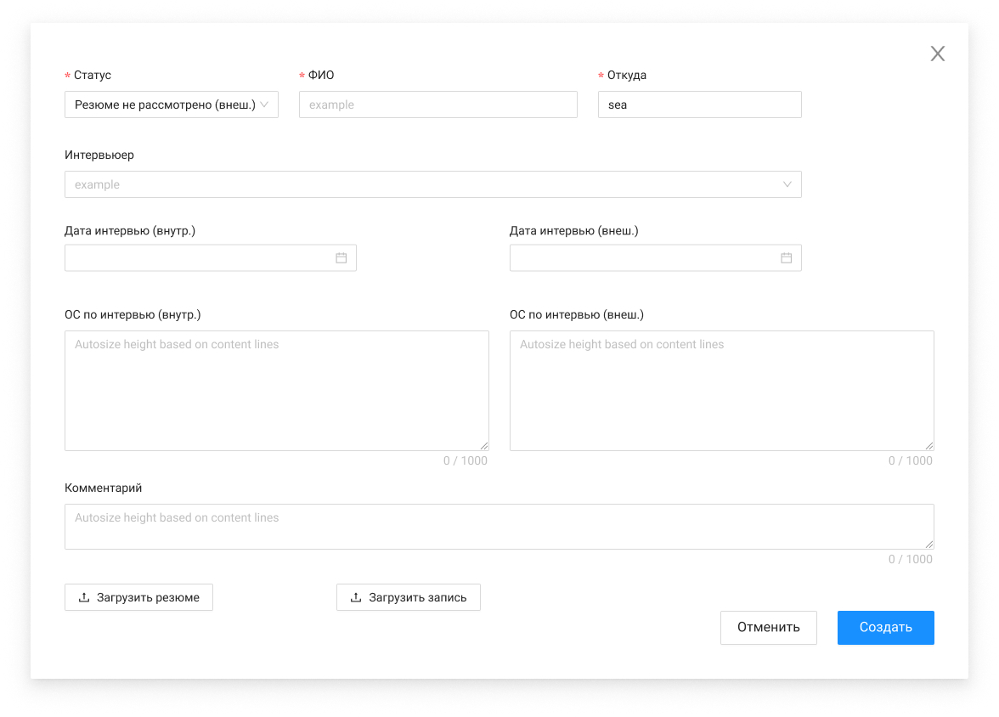
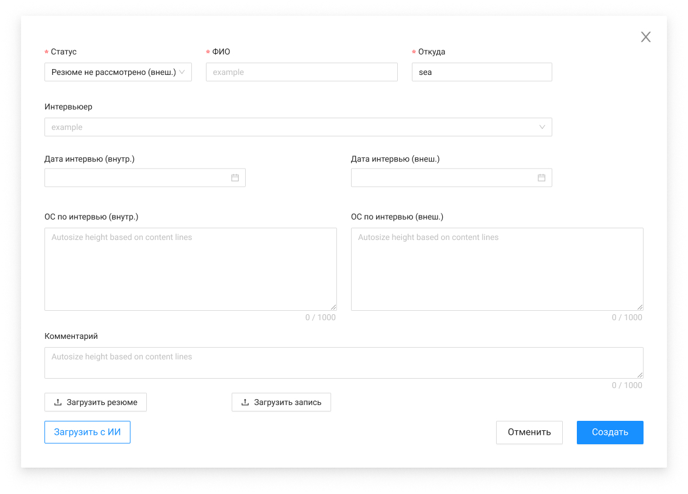

# Создание кандидата

Экранная форма ver. 1

Экранная форма ver. 2

| Название элемента | Формат | Доступность | Обязательность | Input / Output | Описание / Комментарий |
| --- | --- | --- | --- | --- | --- |
| Статус | Select | FA | Да | status | enum: / Отказ по резюме (внутр.) / Назначено интервью (внутр.) / Проведено интервью (внутр.) / Резюме подготовлено / Резюме отправлено / Резюме не рассмотрено (внеш.) / Назначено интервью (внеш.) / Проведено интервью (внеш.) / Готовы брать / Кандидат подключен / Отказ по интервью (внутр.) / Отказ по резюме (внеш.) / Отказ по интервью (внеш.) / Кандидат отказался / Отмена / Автозаполнение значением Назначено интервью (внутр.) с возможностью изменения |
| ФИО | Input | FA | Да | fullName | **Валидация:** если поле не заполнено, то при нажатии на кнопку "Создать" поле выделяется красным и под ним появляется текстовая подсказка "Пожалуйста, заполните ФИО" |
| Откуда | Auto complete | FA | Да | wherefrom | При вводе значения выводит подсказку с подходящими значениями / Список значений: / ПЦКС / ДЦКС / Лига / Рынок / BSS / PureCommit / Senla / **Валидация:** если поле не заполнено, то при нажатии на кнопку "Создать" поле выделяется красным и под ним появляется текстовая подсказка "Пожалуйста, заполните откуда" |
| Интервьюер | Multi select | FA | Нет | **interviewers****:** / lastName + firstName | Выбор значения из сущности planer.employees, выводятся только сотрудники, у которых type = Внутренний и status = Работает / Возможно выбрать только 3 значения |
| Дата интервью (внутр.) | Multiple date picker | FA | Нет | **interviews****:** / date + type | Максимальное количество дат - 3, type = INTERNAL |
| Дата интервью (внеш.) | Multiple date picker | FA | Нет | **interviews****:** / date + type | Максимальное количество дат - 3, type = EXTERNAL |
| ОС по интервью (внутр.) | Input | FA | Нет | screeningFeedback | Ограничение 1000 символов |
| ОС по интервью (внеш.) | Input | FA | Нет | customerFeedback | Ограничение 1000 символов |
| Комментарий | Input | FA | Нет | comment | Ограничение 1000 символов |
| Загрузить резюме | Button | FA | - | - | По нажатию открывает проводник системы с возможностью выбора одного файла для загрузки, после успешного выбора файла вызывает метод POST /management/files, который загружает файл в файловое хранилище. При повторной загрузке происходит замена загруженного файла / Загруженный файл отображается под кнопкой, при наведении напротив файла появляется иконка , по нажатию на нее отменяется прикрепление файла (fileUuid = null) / Максимальный размер файла - 10 МБ. Допустимые форматы для загрузки: .pdf, .doc, .docx / **Валидации:** / при загрузке файла выполняется проверка размера, если размер больше 10 МБ, то загрузка прерывается и выводится окно с ошибкой "Размер файла превышает допустимый лимит 10 МБ" / при загрузке файла выполняется проверка формата, если формат не является одним из допустимых, то загрузка прерывается и выводится окно с ошибкой "Недопустимый формат файла. Разрешены файлы формата .pdf, .doc, .docx." |
| Загрузить запись | Button | FA | - | - | По нажатию открывает проводник системы с возможностью выбора одной записи для загрузки, после успешного выбора вызывает метод POST /management/files, который загружает запись в файловое хранилище. При повторной загрузке происходит замена загруженной записи / Загруженная запись отображается под кнопкой, при наведении напротив записи появляется иконка , по нажатию на нее отменяется прикрепление записи (audioUuid = null) / Максимальный размер файла - 50 МБ / **Валидации:** / при загрузке записи выполняется проверка размера, если размер больше 50 МБ, то загрузка прерывается и выводится окно с ошибкой "Размер записи превышает допустимый лимит 50 МБ" |
| Загрузить с ИИ | Button | FA | - | - | По нажатию вызывает метод POST /management/vacancies/ai/{vacancyId} , который направляет резюме кандидата на проверку соответствия навыков / После вызова метода осуществляется матчинг навыков и в комментарии выводится дата проверки и "Результат проверки ИИ" в табличном формате. / ФИО кандидата из резюме подтягивается в поле ФИО, после успешного ответа метода / При условии, что файл формата не doc, docx, pdf, выводить ошибку = Не удалось распознать файл / При условии, что API отвечает 500 кодом, выводить ошибку = НейроAPI недоступно / В ответе метода возвращается jobId.  Фронт периодически вызывает метод GET /management/vacancies/ai/{jobId} для получения статуса и результата. / Если status = COMPLETED или ERROR, процесс опроса сервера прекращается. / Если status = PROCESSING, вызов метода продолжается до получения вышеуказанных статусов |
| Создать | Button | FA | - | - | По нажатию вызывает метод POST /management/vacancies/{vacancyId}/candidates, который создает запись о кандидате и закрывает ЭФ |
| Отменить | Button | FA | - | - | По нажатию отменяет создание и закрывает ЭФ |
