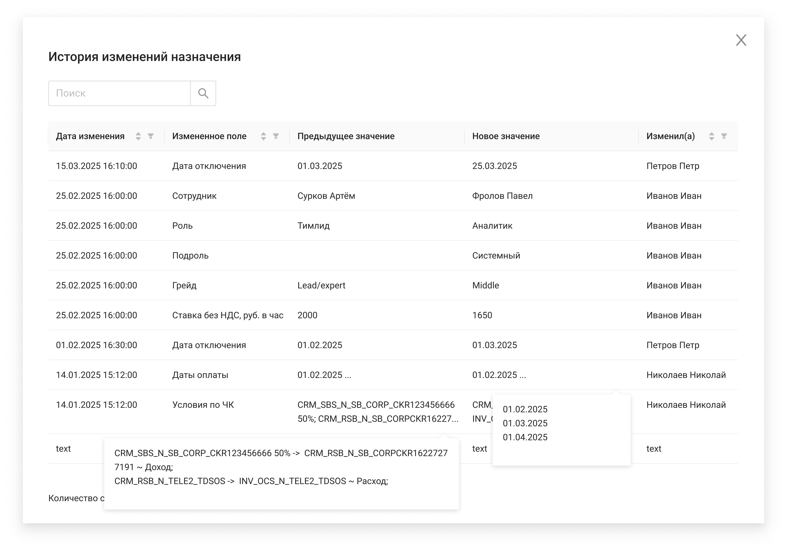

# История изменений назначения

| --- |
|  |

#### Экранная форма

#### Описание экранной формы

При открытии ЭФ "История изменений назначения" выполняется дефолтная сортировка по дате изменения (сначала последние изменения).

| Название элемента | Формат | Доступность | Обязательность | Input/ Output | Описание/Комментарий |
| --- | --- | --- | --- | --- | --- |
| Поиск | Search | FA | - | - | Поиск по истории изменений |
| Дата изменения | Text | RO | Да | updatedAt | Отображает информацию о дате изменения |
| Измененное поле | Text | RO | Да | changedField | Отображает информацию, какое поле было изменено в карточке назначения |
| Предыдущее значение | Text | RO | Да | previousValue | Отображает информацию о прошлом значение измененного поля. Если измененное поле = "Условия по ЧК" & "Даты оплаты", то при наведении на ячейку всплывает Popover со всеми значениями. Если поле пустое, то Popover всплывать не должен. |
| Новое значение | Text | RO | Да | newValue | Отображает информацию о прошлом значение измененного поля. Парсинг поля: / Если измененное поле = "Условия по ЧК" (если fieldDataType = "ARRAY_STRING"), то строку преобразовываем в массив строк (разделитель **;** ). / Если измененное поле = "Даты оплаты" (если fieldDataType = "ARRAY_DATE"), то строку преобразовываем в массив дат (разделитель **;** ). / Если измененное поле = "Дата подключения" или "Дата отключения" (если fieldDataType = "DATE"), то строку преобразовываем в дату. / Если измененное поле = "Условия по ЧК" или "Даты оплаты" (если fieldDataType = "ARRAY_STRING" или "ARRAY_DATE"), то при наведении на ячейку всплывает Popover со всеми значениями. Если поле пустое, то Popover всплывать не должен. |
| Изменил(а) | Text | RO | Да | updatedBy | Отображает информацию о том, кто изменял (только Фамилия Имя) |
| Сортировка | Icon-sort | FA | - | - | При нажатии сортирует значения в столбце по возрастанию/убыванию.  При открытии ЭФ "История изменений" выполняется дефолтная сортировка по дате изменения (сначала последние изменения). |
| Фильтрация | Icon-filter | FA | - | - | При нажатии показывает меню со значениями в столбце, по которым можно применить фильтрацию |
| Количество строк | Text | RO | - | - | Счетчик отображаемых строк |
| Пагинация | Pagination | RO (FA если количество страниц 2 и более) | - | - | Нумерация страниц |
| Крестик | button | FA | - | - | Закрывает экранную форму |
