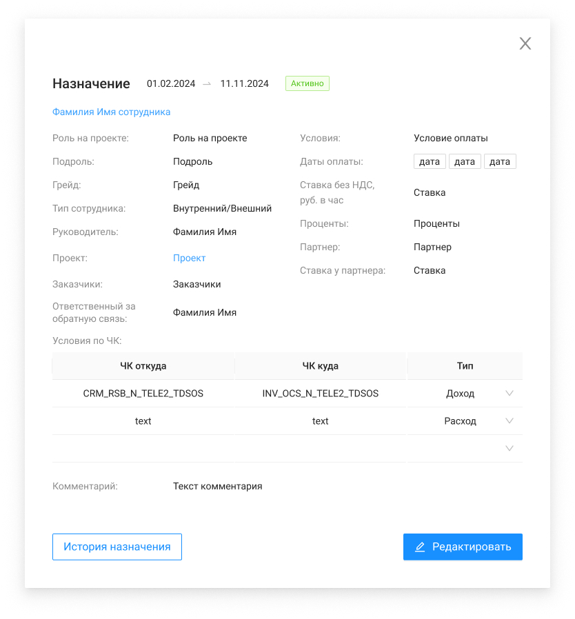

# Карточка назначения (просмотр)

Экран просмотра данных назначения с переходами в карточки сотрудника и проекта.

## Элементы

| Элемент | Формат | Доступ | Обяз. | Поле | Комментарий |
| --- | --- | --- | --- | --- | --- |
| Назначение | Text | RO | да | — | Заголовок |
| ФИО сотрудника | Text | RO | да | lastName + firstName | Клик → карточка сотрудника |
| Статус | Text | RO | да | status | |
| Дата подключения / отключения | Text | RO | да | startDate, endDate | |
| Роль на проекте | Text | RO | да | role | |
| Подроль | Text | RO | нет | subrole | |
| Грейд | Text | RO | да | grade | |
| Тип сотрудника | Text | RO | да | type | Из карточки сотрудника |
| Руководитель | Text | RO | нет | leader / externalManager | Внутренний → руководитель; внешний → внешний менеджер |
| Проект | Text | RO | да | name | Клик → карточка проекта |
| Заказчики | Text | RO | да | customers | Ширина 465 px |
| Ответственный за ОС | Text | RO | нет | responsibleForFeedback | Если заполнено |
| Условия по ЧК | List | RO | нет | chargeCodes | Если есть записи |
| Условия | Text | RO | да | condition | |
| Даты оплаты | Tags | RO | да | paymentDate | |
| Ставка без НДС | Text | RO | нет | rateNoNds | |
| Проценты | Text | RO | нет | percent | |
| Партнер / ставка партнера | Text | RO | нет | partner, ratePartner | |
| Комментарий | Text | RO | нет | comment | Ширина 465 px |
| Редактировать | Button | FA | — | — | GET roles, employees, projects → форма редактирования |
| История назначения | Button | FA | — | — | GET `/management/appointments/{id}/history` |

## Связанные материалы

- [Редактирование](../../Use-cases/Назначения/редактирование-назначения.md)
- [История изменений назначения](история-изменений-назначения.md)
