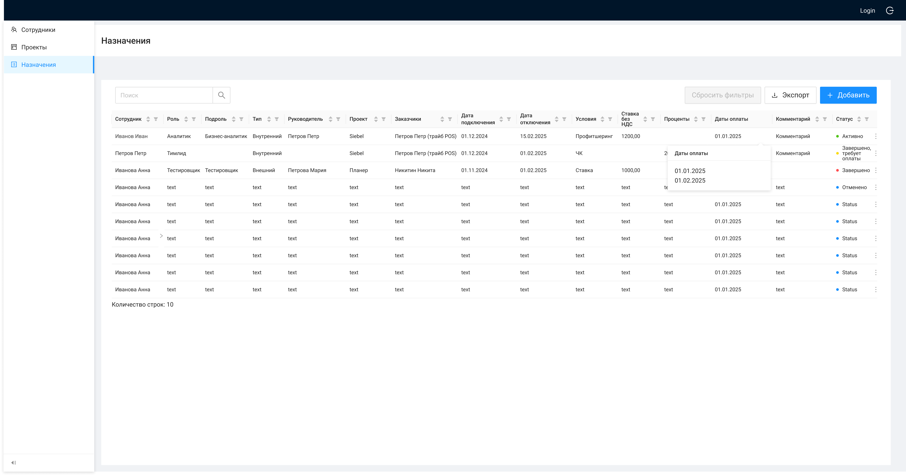

# Форма редактирования назначения

| Элемент | Формат | Доступ | Обяз. | Поле | Комментарий |
| --- | --- | --- | --- | --- | --- |
| Статус | Select | FA | да | status | Активно / Завершено, ожидает оплаты / Завершено / Отменено |
| Сотрудник | Select (entity-selector) | FA | да | employee | «Работает» + текущий сотрудник; автозаполнение роли, подроли, грейда |
| Роль на проекте | Select | FA | нет | role | Справочник ролей |
| Подроль | Select | FA | да | subrole | Зависит от роли |
| Грейд | Select | FA | да | grade | |
| Проект | Select | FA | да | project | Активные проекты |
| Заказчики | Input | FA | нет | customers | |
| Ответственный за ОС | Input | FA | да | responsibleForFeedback | |
| Условия | Select | FA | да | condition | |
| Даты оплаты | Multiple datepicker | FA | условно | paymentDate | До 20 дат |
| Даты подключения / отключения | Date picker | FA | да / нет | startDate, endDate | |
| Условия по ЧК | Таблица | FA | нет | chargeCodes | |
| Ставка / Проценты | Input number | FA | нет | rateNoNds, percent | По условию |
| Партнер / ставка | Input | FA | нет | partner, ratePartner | Внешний сотрудник |
| Комментарий | Input | FA | да | comment | |
| Сохранить | Button | FA | — | — | Валидация → PUT `/management/appointments/{id}` → карточка |
| Отменить | Button | FA | — | — | Без сохранения |

## Связанные материалы

- [Use Case: Редактирование назначения](../../Use-cases/Назначения/редактирование-назначения.md)
