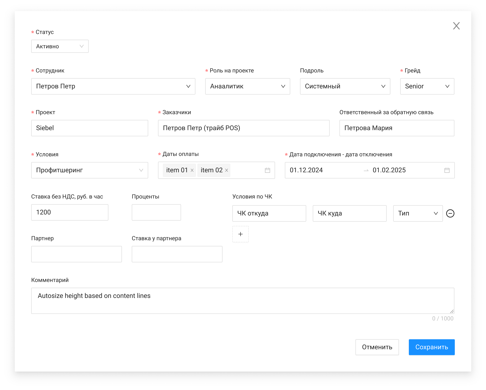

# Форма создания назначения

Полная спецификация полей — из Confluence «Описание реализации», раздел «Карточка назначения → Создание назначения».

| Элемент | Формат | Доступ | Обяз. | Поле | Комментарий |
| --- | --- | --- | --- | --- | --- |
| Сотрудник | Select (entity-selector) | FA | да | employee | Поиск; только статус «Работает»; автозаполнение роли, подроли, грейда |
| Роль на проекте | Select | FA | да | role | Справочник ролей (Менеджер, Тимлид, Аналитик, …, Иное) |
| Подроль | Select | FA | нет | subrole | Зависит от роли; для Тимлид/DevOps/Техлид — неактивна |
| Грейд | Select | FA | да | grade | Lead/expert … Trainee |
| Проект | Select | FA | да | project | Только проекты со статусом «Активный» |
| Заказчики | Input | FA | да | customers | |
| Ответственный за ОС | Input | FA | нет | responsibleForFeedback | |
| Условия | Select | FA | да | condition | Профитшеринг / ЧК / Ставка |
| Даты оплаты | Multiple datepicker | FA | условно | paymentDate | До 20 дат; необяз. при ЧК и percent=0/null |
| Дата подключения / отключения | Date picker | FA | да | startDate, endDate | |
| Условия по ЧК | Таблица | FA | нет | chargeCodes | fromChargeCode, toChargeCode, тип Доход/Расход |
| Ставка без НДС | Input number | FA | нет | rateNoNds | При Профитшеринг/Ставка; формат 1000,00 |
| Проценты | Input number | FA | нет | percent | При ЧК |
| Партнер / ставка партнера | Input | FA | нет | partner, ratePartner | Только для type=Внешний |
| Комментарий | Input | FA | нет | comment | |
| Создать | Button | FA | — | — | Валидация → проверка активного назначения → POST `/management/appointments`, status=ACTIVE |
| Отменить | Button | FA | — | — | Закрытие без сохранения |

## Связанные материалы

- [Use Case: Создание назначения](../../Use-cases/Назначения/создание-назначения.md)
