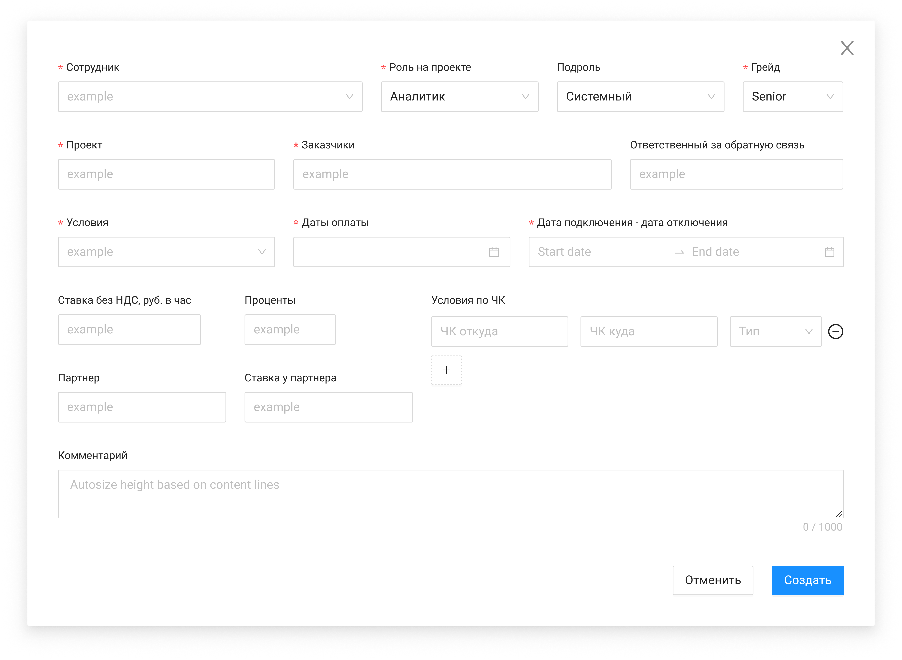

# Список назначений

Главная таблица раздела «Назначения». При открытии — сортировка по `createdAt`, `updatedAt` (сначала новые). Клик по строке → карточка назначения.

## Элементы

| Элемент | Формат | Доступ | Поле | Комментарий |
| --- | --- | --- | --- | --- |
| Выход из системы | Button | FA | — | Завершение сеанса |
| Login | Text | RO | preferred_username | Логин текущего пользователя |
| Добавить | Button | FA | — | Открывает форму создания; GET roles, employees, projects |
| Экспорт | Button | FA | — | GET `/management/appointments/report` → Excel |
| Сбросить фильтры | Button | RO/FA | — | Неактивна без фильтров |
| Поиск | Search | FA | — | Поиск по списку |
| Сотрудник | Text | FA | employee | Закрепленный столбец |
| Роль / Подроль | Text | RO | role, subrole | Из карточки назначения |
| Тип | Text | RO | type | Из карточки сотрудника |
| Руководитель | Text | RO | leader / externalManager | По типу сотрудника |
| Проект | Text | FA | name | |
| Заказчики | Text | RO | customers | |
| Даты подключения / отключения | Text | RO | start_date, end_date | |
| Условия | Text | RO | condition | |
| Ставка / Проценты | Text | RO | rate_no_nds, percent | |
| Даты оплаты | Text + Icon | RO | payment_date | Ближайшая дата ≥ сегодня; popover со всеми датами |
| Комментарий | Text | RO | comment | |
| Статус | Text | RO | status | Закрепленный столбец |
| Сортировка / Фильтрация | Icon | FA | — | Комбинированная сортировка по приоритету столбцов |
| Меню строки | Menu | FA | — | Редактировать, Завершить, Отменить |

## Связанные материалы

- [Создание назначения](../../Use-cases/Назначения/создание-назначения.md)
