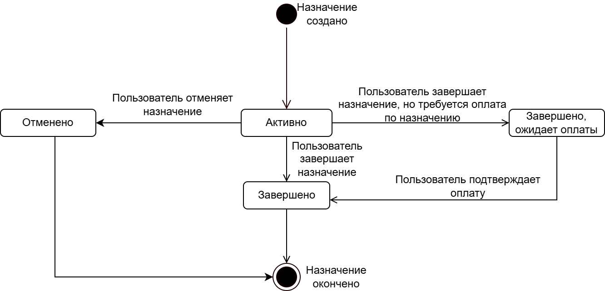

# Диаграмма состояний статусов назначений

Переходы между статусами назначения при создании, завершении и отмене.

## Статусы

- **Активно** — назначение действует.
- **Завершено, ожидает оплаты** — работа завершена, ожидается оплата.
- **Завершено** — назначение закрыто.
- **Отменено** — назначение отменено.

## Связанные материалы

- [Завершение назначения](../../Use-cases/Назначения/завершение-назначения.md)
- [Отмена назначения](../../Use-cases/Назначения/отмена-назначения.md)
