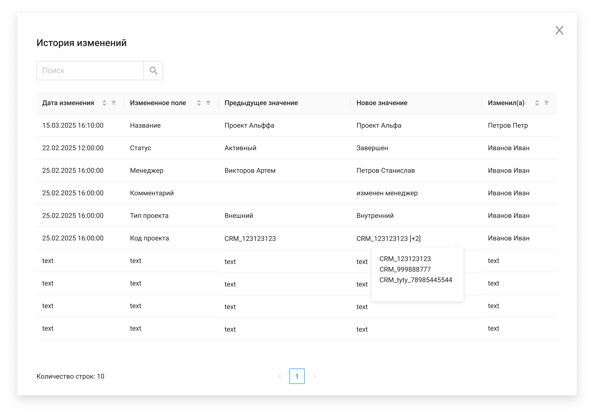

# История изменений проекта

#### Экранная форма

#### Описание экранной формы

| Название элемента | Формат | Доступность | Обязательность | Input/ Output | Описание/Комментарий |
| --- | --- | --- | --- | --- | --- |
| Поиск | Search | FA | - | - | Поиск по записям в истории изменений |
| Дата изменения | Text | RO | Да | updated_datetime | Отображает информацию о дате и времени изменения |
| Измененное поле | Text | RO | Да | changed_field | Отображает информацию, какое поле было изменено |
| Предыдущее значение | Text | RO | Да | previous_value | Отображает информацию о прошлом значение измененного поля. Если измененное поле = "Код проекта", то при наведении на ячейку всплывает Popover со всеми значениями. Если поле пустое, то Popover всплывать не должен. |
| Новое значение | Text | RO | Да | new_value | Отображает информацию о прошлом значение измененного поля. Если измененное поле ="Код проекта", то при наведении на ячейку всплывает Popover со всеми значениями. Если поле пустое, то Popover всплывать не должен. |
| Изменил(а) | Text | RO | Да | updated_by | Отображает информацию о том, кто изменял (Фамилия Имя) |
| Сортировка | Icon-sort | FA | - | - | При нажатии сортирует значения в столбце по возрастанию/убыванию.  При открытии ЭФ "История изменений" выполняется дефолтная сортировка по дате изменения (в начале списка отображаются последние изменения). |
| Фильтрация | Icon-filter | FA | - | - | При нажатии показывает меню со значениями в столбце, по которым можно применить фильтрацию |
| Количество строк | Text | RO | - | - | Счетчик отображаемых строк |
| Пагинация | Pagination | RO (FA если количество страниц 2 и более) | - | - | Нумерация страниц |
| Крестик | button | FA | - | - | Закрывает экранную форму |
