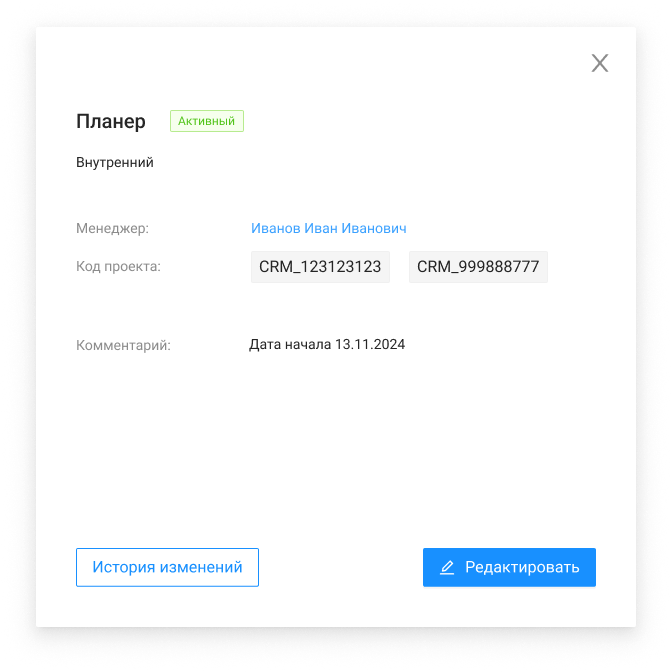
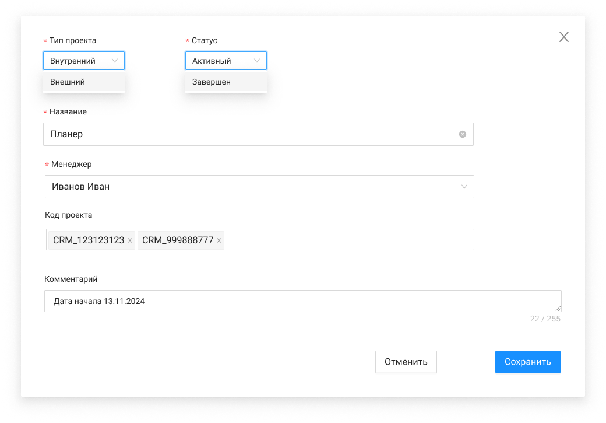

# Редактирование проекта

##### ЭФ "Карточка проекта"

| Название элемента | Формат | Доступность | Обязательность | **Input** | Описание |
| --- | --- | --- | --- | --- | --- |
| Название | Text | RO | Да | name | Отображает  Название проекта. / Если название проекта выходит за ширину карточки, необходимо перенести его на следующую строку (при этом статус смещать вправо) |
| Статус | Text | RO | Да | status | Отображает статус проекта *Активный или Завершен |
| Тип проекта | Text | RO | Да | type | Отображает Тип проекта Внутренний или Внешний |
| Менеджер | Text | RO | Да | manager: / lastName + firstName + middleName | Отображает ФИО менеджера По нажатию вызывается метод GET /management/projects/{id}, открывается ЭФ просмотра карточки сотрудника |
| Код проекта | Text | RO | Нет | chargeCode | Отображает список ЧК "тегами"  Значения хранятся в строку с разделителем ";". При вызове поля используется парсер / Если поле не заполнено в БД, не отображать его в карточке проекта. |
| Комментарий | Text | RO | Нет | comment | Если поле комментарий не заполнено, не отображать его в карточке проекта. Если поле комментарий выходит за ширину карточки переносить его на другую строку |
| Редактировать | button | FA | - | - | По нажатию: / вызывает метод GET /management/projects / открывает ЭФ |
| История изменений | Button | FA | - | - | По нажатию вызывается метод GET /management/projects/{projectId}/history По нажатию  открывает ЭФ |
| Крестик | button | FA | - | - | Закрывает экранную форму |

##### ЭФ "Редактирование карточки проекта"

##### Описание экранной формы

| Название элемента | Формат | Доступность | Обязательность | **Input** | Описание |
| --- | --- | --- | --- | --- | --- |
| Статус | select - Справочник / enum: Активный/Завершен | FA | Да | status | enum: / Активный / Завершен / Если проект переводится в статус Завершен, то у него не может быть активных назначений |
| Название | Input - Поле ввода | FA | Да | name | Название проекта должно быть уникальным. Иначе ошибка "Проект с таким названием уже существует". Форма не должна закрываться / Название проекта не должно быть пустым. Иначе ошибка "Название проекта не должно быть пустым." / Минимальная длина названия - 3 символа, максимальная длина - 100 символов. Иначе ошибка "Длина названия должна быть от 3 до 100 символов" / Название должно содержать только буквы, цифры, пробелы и следующие специальные символы: "-", "_", ".", "(", ")", ' " '(двойные кавычки), Иначе ошибка: "Название проекта содержит недопустимые символы." |
| Менеджер | select - Справочник | FA | Да | manager: / lastName + firstName + middleName | Подтягиваются только ФИО сотрудников с ролью Менеджер из таблицы сотрудники и статусом "Работает" / ФИО менеджера должно отображаться в корректном формате ("Фамилия Имя Отчество (при наличии)"). |
| Код проекта | Input - Поле ввода | FA | Нет | chargeCode | Может быть введено в поле несколько ЧК. Новый ЧК вводить через пробел/enter. Значения хранятся в строку с разделителем ";". При вызове поля используется парсер / Минимальная длина кода- 3 символа, максимальная длина - 40 символов. Иначе ошибка: "Длина кода проекта должна быть от 3 до 40 символов." / Поле должно содержать только буквы, цифры, пробелы и следующие специальные символы: "-", "_" |
| Тип проекта | Select | FA | Да | type | **Выделить как обязательное поле ** Значение, выбранное пользователем, должно соответствовать одному из значений enum: / Внутренний / Внешний |
| Комментарий | textarea | FA | Нет | comment | Длина комментария не должна превышать 1000 символов. |
| Отменить | button | FA | - | - | Закрывает экранную форму  без сохранения изменений |
| Сохранить | button | FA | - | - | По нажатию: / если при редактировании был изменен status на "Завершен", то проводится проверка на наличие активных назначений с этим проектом. Если они есть, то выводится pop-up с сообщением, что у проекта есть активное назначение и его нельзя завершить, запись о проекте не обновляется. Иначе (если активных назначений с этим проектом нет) переход к следующему пункту. / если при редактировании не был изменен status, то вызывается метод PATCH /management/project/{id}, который обновляет запись о проекте и закрывает ЭФ |
| Крестик | button | FA | - | - | Закрывает экранную форму  без сохранения изменений |
