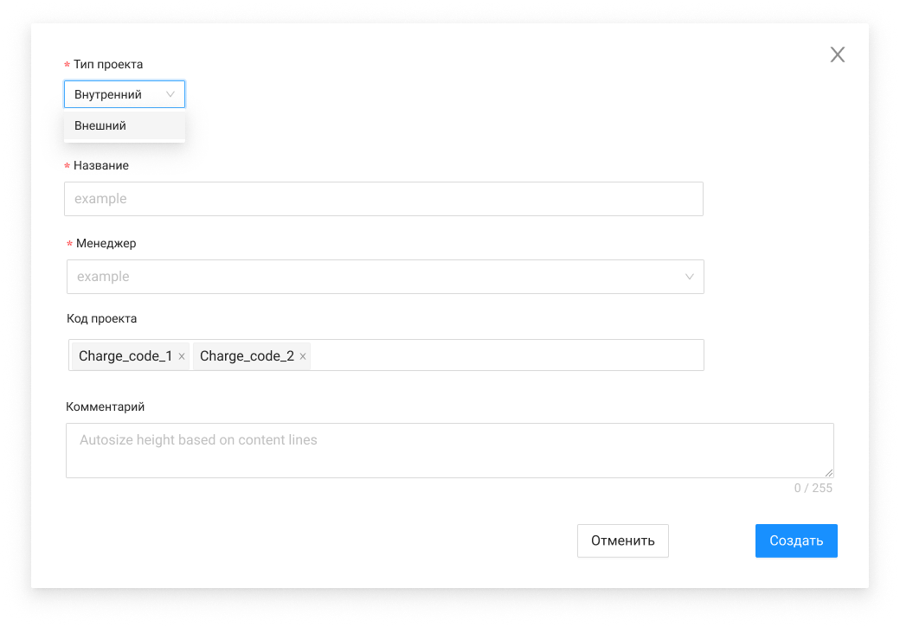

# Создание проекта

##### ЭФ "Создание нового проекта"

##### Описание экранной формы

| Название элемента | Формат | Доступность | Обязательность | Input/output | Описание |
| --- | --- | --- | --- | --- | --- |
| Название | Input - Поле ввода | FA | Да | name | Название проекта должно быть уникальным. Иначе ошибка "Проект с таким названием уже существует". При этом на карточке введенное название остается, карточка не закрывается / Название проекта не должно быть пустым. Иначе ошибка "Название проекта не должно быть пустым." / Минимальная длина названия - 3 символа, максимальная длина - 100 символов. Иначе ошибка "Длина названия должна быть от 3 до 100 символов" / Название должно содержать только буквы, цифры, пробелы и следующие специальные символы: "-", "_", ".", "(", ")", ' " '(двойные кавычки), Иначе ошибка: "Название проекта содержит недопустимые символы." |
| Менеджер | select - Справочник (с возможностью ввода) | FA | Да | manager: / lastName + firstName + middleName | Подтягиваются только ФИО сотрудников с ролью Менеджер из таблицы сотрудники и статусом "Работает" / ФИО менеджера должно отображаться в корректном формате ("Фамилия Имя Отчество (при наличии)"). |
| Код проекта | Input - Поле ввода | FA | Нет | chargeCode | Может быть введено в поле несколько ЧК. Новый ЧК вводить через пробел/enter. Значения хранятся в строку с разделителем ";". При вызове поля используется парсер / Минимальная длина кода- 3 символа, максимальная длина - 40 символов. Иначе ошибка: "Длина кода проекта должна быть от 3 до 40 символов." / Поле должно содержать только буквы, цифры, пробелы и следующие специальные символы: "-", "_" |
| Тип проекта | Select | FA | **Да** | type | **Выделить как обязательное поле ** Значение, выбранное пользователем, должно соответствовать одному из значений enum: / Внутренний - значение по умолчанию / Внешний |
| Комментарий | textarea - Поле ввода | FA | Нет | comment | Длина комментария не должна превышать 1000 символов. |
| Создать | button | FA | - | - | По нажатию: / Если не все (или одно из) обязательные поля заполнены, то незаполненные обязательные поля подсвечиваются красным с предупреждением / "Пожалуйста, введите Название" и / "Пожалуйста, укажите менеджера" соответственно. Иначе / Проводятся проверки указанные в / **автоматически проставляет status = ACTIVE** / вызывает метод POST  /management/projects / закрывает ЭФ / новый созданный проект отображает в списке проектов вверху |
| Отменить | button | FA | - | - | По нажатию закрывает экранную форму  без сохранения изменений |
| Крестик | button | FA | - | - | По нажатию закрывает экранную форму  без сохранения изменений |
