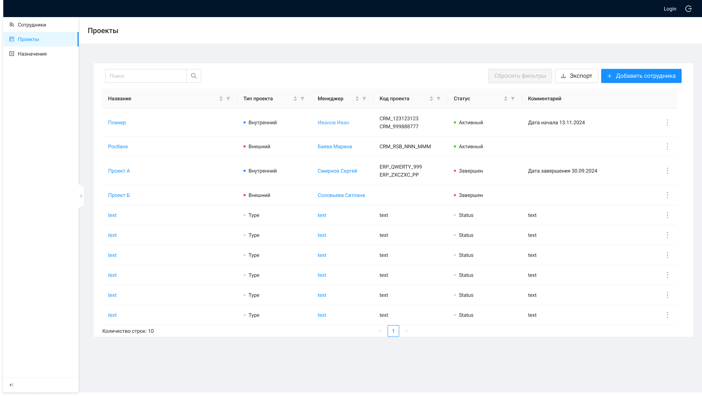

# Список проектов

##### Описание экранной формы

**Позиционирование**:
При открытии ЭФ "Список проектов:
вызывается только метод GET /management/projects (*сейчас тянется еще и GET /management/employees)
выполняется сортировка по умолчанию: по полям "createdDate" и "updatedDate": сначала идут новые записи, ниже более старые;
По двойному нажатию на строку вызывается метод GET /management/projects/{id},открывается .

| Название элемента | Формат | Доступность | Обязательность | **Input** | Описание |
| --- | --- | --- | --- | --- | --- |
| **Header** | **Header** | **Header** | **Header** | **Header** | **Header** |
| Инструкция | Button | FA | - | - | По нажатию открывает страницу |
| Выход из системы | Button | FA | - | - | По нажатию выходит из системы (завершение сеанса пользователя) |
| Login | Text | RO | Да | preferred_username | Отображает логин пользователя под которым он зашел в систему |
| **Main** | **Main** | **Main** | **Main** | **Main** | **Main** |
| Создать проект | button | FA | - | - | По нажатию: / вызывает метод GET /management/employees / Открывает ЭФ |
| Экспорт | Button | FA | - | - | По нажатию вызывается метод для экспорта данных в Excel GET /management/projects/report |
| Сбросить фильтры | Button | RO (FA если применена фильтрация) | - | - | По нажатию сбрасывает все примененные фильтры / Неактивна, если нет примененных фильтров |
| Таблица | Таблица | - | - | - | Содержит описание проектов |
| Название | Info | FA | да | name | Отображает информацию из поля Название проекта карточки проекта |
| Менеджер | Info | FA | да | lastName + firstName + middleName | Отображает информацию из поля Ответственный менеджер карточки проекта, по нажатию на текст открывается ЭФ просмотра карточки сотрудника |
| Код проекта | Info | RO | нет | chargeCode | Отображает информацию из поля Код проекта карточки проекта. Если Кодов несколько каждый начинается с новой строки / При наведении на ячейку всплывает Popover со всеми значениями |
| Тип проекта | Info | RO | да | type | Отображает информацию из поля "Тип проекта" карточки проекта |
| Статус | Info | RO | да | status | Отображает информацию из поля "Статус" карточки проекта |
| Комментарий | Info | RO | нет | comment | Отображает информацию из поля Комментарий карточки проекта / Фиксированная ширина поля 225, высота **≈**100 |
| Фильтрация | Icon filter | FA | - | - | При нажатии показывает меню с чекбоксами значениями столбца, по которым можно применить фильтрацию |
| Сортировка | Icon sorter | FA | - | - | По нажатию сортирует столбец по убыванию/возрастанию, если открыта страница > 1, то возвращает пользователя на 1 страницу с применением сортировки. / Приоритет столбцов при комбинированной ручной сортировке: / Статус (сначала "Активный") / Менеджер / Название / Тип проекта (сначала "Внутренний") / Комментарий (сначала где есть комментарий) |
| Поиск | Search-Box | FA | - | - | Поле для ввода ключевого слова для Поиска |
| Боковое меню | More | FA | - | - | При наведении раскрывает меню с выбором действий: / Редактировать (по нажатию вызывает метод GET /management/projects/{id}, открывает ЭФ редактирования карточки проекта) / Завершить (по нажатию открывает модальное окно и при выборе "Да" меняет статус проекта на "Завершен") |
| Количество строк | Text | RO | - | - | Счетчик количества отображаемых строк |
| Пагинация | Pagination | RO (FA если страниц 2 и более) | - | - | Отображает количество страниц в списке. Если страниц 2 и более активны табы для переключения между страницами |
