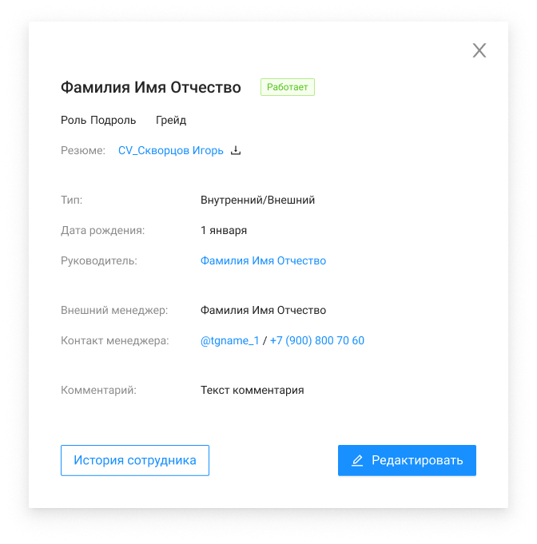

# Карточка сотрудника

| Название элемента | Формат | Доступность | Обязательность | Input / Output | Описание / Комментарий |
| --- | --- | --- | --- | --- | --- |
| Фамилия | Text | RO | Да | lastName | Отображает информацию из поля "Фамилия" |
| Имя | Text | RO | Да | firstName | Отображает информацию из поля "Имя" |
| Отчество | Text | RO | Нет | middleName | Отображает информацию из поля "Отчество" |
| Статус | Tag | RO | Да | status | Отображает информацию из поля "Статус" |
| Роль | Text | RO | Да | **role:** / name | Отображает информацию из поля "Роль" |
| Подроль | Text | RO | Нет | **subrole:** / name | Отображает информацию из поля "Подроль" |
| Грейд | Text | RO | Да | grade | Отображает информацию из поля "Грейд" |
| Резюме | Text | FA | Нет | **file:** / name + link | Отображает название файла в виде кликабельной ссылки на скачивание. По нажатию начинает скачивание файла-резюме / Если значение null, то не отображается |
| Тип | Text | RO | Да | type | Отображает информацию из поля "Тип сотрудника" |
| Дата рождения | Text | RO | Нет | birthDate | Отображает информацию из поля "Дата рождения" |
| Руководитель | Text | FA | Нет | **leader:** / lastName + firstName + middleName | Отображает информацию из поля "Руководитель". Если указано значение, то по нажатию вызывается метод GET /management/employees/{id}, открывается ЭФ просмотра карточки руководителя |
| Внешний менеджер | Text | RO | Нет | externalManager | Отображает информацию из поля "Внешний менеджер" |
| Контакт менеджера | Text | FA | Нет | managerContact | Отображает информацию из поля "Контакт менеджера" в виде кликабельной ссылки. По нажатию на ссылку открывается новая вкладка с Telegram |
| Комментарий | Text | RO | Нет | comment | Отображает информацию из поля "Комментарий" |
| Редактировать | Button | FA | - | - | По нажатию: / вызывает метод GET /management/roles / вызывает метод GET /management/employees / открывает ЭФ |
| История сотрудника | Button | FA | - | - | По нажатию вызывает метод GET /management/employees/{employeeId}/history, открывает ЭФ |
