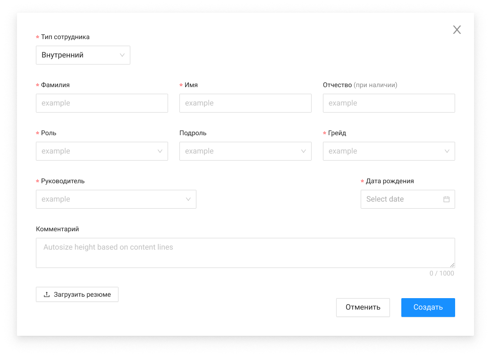
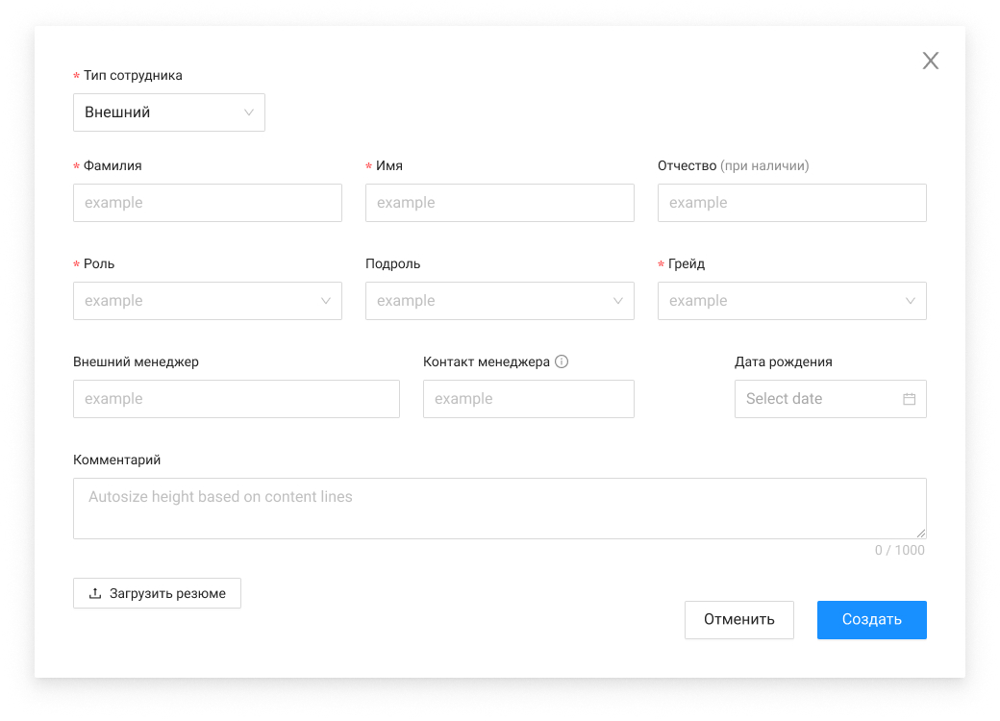

# Создание сотрудника

| Название элемента | Формат | Доступность | Обязательность | Input / Output | Описание / Комментарий |
| --- | --- | --- | --- | --- | --- |
| Тип сотрудника | Select | FA | Да | type | enum: / Внутренний - значение по умолчанию / Внешний |
| Фамилия | Input | FA | Да | lastName | **Валидация:** если поле не заполнено, то при нажатии на кнопку "Создать" поле выделяется красным и под ним появляется текстовая подсказка "Пожалуйста, заполните фамилию" |
| Имя | Input | FA | Да | firstName | **Валидация:** если поле не заполнено, то при нажатии на кнопку "Создать" поле выделяется красным и под ним появляется текстовая подсказка "Пожалуйста, заполните имя" |
| Отчество (при наличии) | Input | FA | Нет | middleName |  |
| Роль | Select | FA | Да | **role:** / name | planer.roles: / Менеджер / Тимлид / Аналитик / Frontend-разработчик / Backend-разработчик / Тестировщик / Архитектор / DevOps / Техлид / Мобильный разработчик / Иное / **Валидация:** если поле не заполнено, то при нажатии на кнопку "Создать" поле выделяется красным и под ним появляется текстовая подсказка "Пожалуйста, заполните роль" |
| Подроль | Select | FA (если role = Менеджер, Аналитик, Frontend-разработчик, Backend-разработчик, Тестировщик, Архитектор) | Нет | **subrole:** / name | planer.subroles: / **Если выбрана роль Менеджер:** / Владелец продукта / Проектный менеджер / Администратор проектов / **Если выбрана роль Аналитик:** / Бизнес / Системный / Данных / Fullstack / **Если выбрана роль Frontend-разработчик:** / React / Angular / Vue / **Если выбрана роль Backend-разработчик:** / Siebel / C# / Java / 1С / .NET / PHP / Python / Golang / **Если выбрана роль Тестировщик:** / Мануальный / Автоматизация / Fullstack QA / Нагрузка / **Если выбрана роль Архитектор:** / Системный / Enterprise / Solution / **Если выбрана роль Мобильный разработчик:** / Swift / Kotlin / Иначе, (если выбраны роли Тимлид, DevOps, Техлид, Иное) поле неактивно |
| Грейд | Select | FA | Да | grade | enum: / Lead/expert / Senior+ / Senior / Senior- / Middle+ / Middle / Middle- / Junior / Trainee / **Валидация:** если поле не заполнено, то при нажатии на кнопку "Создать" поле выделяется красным и под ним появляется текстовая подсказка "Пожалуйста, заполните грейд" |
| Дата рождения | Date picker | FA | Нет (является обязательным, если type = Внутренний) | birthDate | **Валидация:** если type = Внутренний и поле не заполнено, то при нажатии на кнопку "Создать" поле выделяется красным и под ним появляется текстовая подсказка "Пожалуйста, заполните дату рождения" |
| Руководитель | Select | FA (если type = Внутренний) | Нет (не является обязательным если role = Тимлид, Менеджер) | **leader:** / lastName + firstName + middleName | Отображается, если type = Внутренний / В списке выводятся сотрудники с ролями Тимлид и Менеджер / **Валидация:** если type = Внутренний и role != Тимлид, Менеджер, и поле не заполнено, то при нажатии на кнопку "Создать" поле выделяется красным и под ним появляется текстовая подсказка "Пожалуйста, заполните руководителя" |
| Внешний менеджер | Input | FA (если type = Внешний) | Нет | externalManager | Отображается, если type = Внешний |
| Контакт менеджера | Input | FA (если type = Внешний) | Нет | managerContact | Отображается, если type = Внешний |
|  | Tooltip | FA (если type = Внешний) | - | - | Относится к элементу "Контакт менеджера". По нажатию выводит подсказку по заполнению поля: Укажите Telegram в формате "@tgname_1" или номер телефона в форматах "+7ХХХХХХХХХХ" / "8ХХХХХХХХХХ" |
| Комментарий | Input | FA | Нет | comment | Ограничение 1000 символов |
| Загрузить резюме | Button | FA | - | - | По нажатию открывает проводник системы с возможностью выбора одного файла для загрузки, после успешного выбора файла вызывает метод POST /management/files, который загружает файл в файловое хранилище. При повторной загрузке происходит замена загруженного файла / Загруженный файл отображается под кнопкой, при наведении напротив файла появляется иконка , по нажатию на нее отменяется прикрепление файла (fileUuid = null) / Максимальный размер файла - 10 МБ. Максимальная длина названия файла - 30 символов. Допустимые форматы для загрузки: .pdf, .doc, .docx / **Валидации:** / при загрузке файла выполняется проверка размера, если размер больше 10 МБ, то загрузка прерывается и выводится окно с ошибкой "Размер файла превышает допустимый лимит 10 МБ" / при загрузке файла выполняется проверка формата, если формат не является одним из допустимых, то загрузка прерывается и выводится окно с ошибкой "Недопустимый формат файла. Разрешены файлы формата .pdf, .doc, .docx." / при загрузке файла выполняется проверка длины названия, если длина названия больше 30 символов, то загрузка прерывается и выводится окно с ошибкой "Название файла превышает допустимую длину в 30 символов" |
| Создать | Button | FA | - | - | По нажатию вызывает метод POST /management/employees, который создает запись о сотруднике (status = ACTIVE) и закрывает ЭФ |
| Отменить | Button | FA | - | - | По нажатию отменяет создание и закрывает ЭФ |
