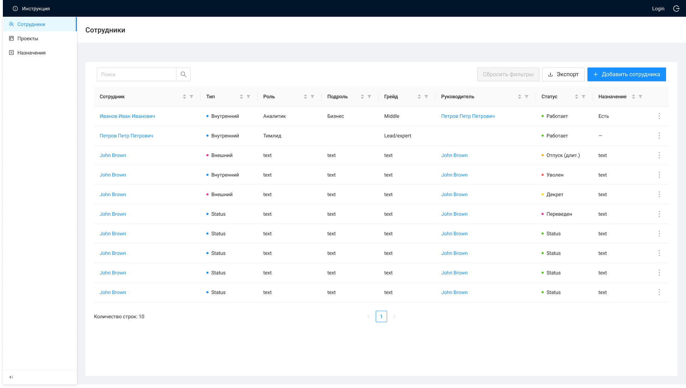

# Список сотрудников

При открытии ЭФ "Список сотрудников":
вызывается метод GET /management/employees
выполняется сортировка по умолчанию: по полям "createdAt" и "updatedAt": сначала идут новые записи, ниже более старые
По двойному нажатию на строку вызывается метод GET /management/employees/{id}, открывается ЭФ

| Название элемента | Формат | Доступность | Обязательность | Input / Output | Описание / Комментарий |
| --- | --- | --- | --- | --- | --- |
| **Header** | **Header** | **Header** | **Header** | **Header** | **Header** |
| Инструкция | Button | FA | - | - | По нажатию открывает страницу |
| Выход из системы | Button | FA | - | - | По нажатию выходит из системы (завершение сеанса пользователя) |
| Login | Text | RO | Да | preferred_username | Отображает логин пользователя под которым он зашел в систему |
| **Main** | **Main** | **Main** | **Main** | **Main** | **Main** |
| Добавить сотрудника | Button | FA | - | - | По нажатию: / вызывает метод GET /management/roles / вызывает метод GET /management/employees / открывает ЭФ |
| Экспорт | Button | FA | - | - | По нажатию вызывает метод GET /management/employees/report |
| Сбросить фильтры | Button | RO (FA если применена фильтрация) | - | - | По нажатию сбрасывает все примененные фильтры / Неактивна, если нет примененных фильтров |
| Поиск | Search | FA | - | - | Поиск по списку сотрудников |
| Сотрудник | Text | FA | Да | lastName + firstName + middleName | Отображает информацию из полей карточки сотрудника: "Фамилия" + "Имя" + "Отчество" (если указано), по нажатию на текст вызывается метод GET /management/employees/{id}, открывается ЭФ |
| Роль | Text | RO | Да | **role:** / name | Отображает информацию из поля "Роль" карточки сотрудника |
| Подроль | Text | RO | Нет | **subrole:** / name | Отображает информацию из поля "Подроль" карточки сотрудника |
| Грейд | Text | RO | Да | grade | Отображает информацию из поля "Грейд" карточки сотрудника |
| Руководитель | Text | RO (FA если указан leader) | Нет | **leader:** / lastName + firstName + middleName / **если leader = null, то** / externalManager | 1) Отображает информацию из поля "Руководитель" карточки сотрудника (если type = Внутренний), по нажатию на текст вызывается метод GET /management/employees/{id}, открывается ЭФ / 2) Если поле "Руководитель" не заполнено, отображает информацию из поля "Внешний менеджер" / 3) Если поля "Руководитель" и "Внешний менеджер" не заполнены, то отображает пустую строку |
| Тип | Text | RO | Да | type | Отображает информацию из поля "Тип сотрудника" карточки сотрудника |
| Статус | Text | RO | Да | status | Отображает информацию из поля "Статус" карточки сотрудника |
| Назначение | Text | RO | Да | isExistsAppointment | Отображает информацию о наличии активного назначения у сотрудника: / isExistsAppointment = true (отображает значение "Есть"); / isExistsAppointment = false (отображает значение "—") |
| Сортировка | Icon-sort | FA | - | - | По нажатию сортирует столбец по убыванию/возрастанию, если открыта страница > 1, то возвращает пользователя на 1 страницу с применением сортировки / Приоритет столбцов при ручной комбинированной сортировке: / Статус (сначала "Работает") / Назначение (сначала "—") / Тип (сначала "Внутренний") / Роль / Подроль / Грейд / Руководитель / ФИО |
| Фильтрация | Icon-filter | FA | - | - |  |
|  | Menu | FA | - | - | По наведению раскрывает меню с выбором действий: / Редактировать (по нажатию: вызывает методы GET /management/employees/{id}, GET /management/roles, GET /management/employees; открывает ЭФ редактирования карточки сотрудника) / Уволить (по нажатию открывает модальное окно и при выборе "Да" меняет статус сотрудника на "Уволен") отображается для всех сотрудников, кроме сотрудников со статусом "Уволен" |
| Количество строк | Text | RO | - | - |  |
| Пагинация | Pagination | RO (FA если больше 1 страницы) | - | - |  |
