# Инструкция пользователя

| Оглавление |
| --- |
|  |

## Введение

Система "Планер" - это инструменты для оптимизации планирования и контроля процесса назначения сотрудников на проекты. Система предназначена для пользования менеджерами проектов, тимлидами и руководством практики.

Система позволяет управлять назначениями, просматривать историю изменений, а также получать необходимые уведомления через telegram-бот.

Данная инструкция пользователя содержит пошаговые инструкции по работе с системой "Планер". В ней подробно описаны основные возможности системы, приведены примеры работы с интерфейсом и даны рекомендации по эффективному использованию инструментов.

Основные возможности системы:

| Процесс | Функционал |
| --- | --- |
| Управление назначениями | Заведение сотрудника, проекта, назначения / Внесение изменений о сотруднике, проекте, назначении / Изменения статуса сотрудника (работает, уволен и т.д.), проекта (активный, завершен), назначения (активно, завершено и т.д.) / Экспорт данных в формате Excel. |
| История изменений | Система автоматически отслеживает и хранит историю изменений. / Просмотр истории изменений по конкретному сотруднику, проекту, назначению. |
| Уведомления | С помощью telegram-бота: / Получение уведомлений о дате подключения сотрудника на проект. / Получение уведомлений о дате отключения сотрудника на проекте. / Получение уведомлений о дате оплаты сотрудника на проекте. |

Также в документе описаны вспомогательные процедуры по работе с системой в целом:

Создание карточки

Редактирование карточки

Просмотр списка записей

Просмотр истории изменений

Поиск записей

Сортировка записей

Фильтрация записей

Уведомления

## Описание функционала

Детальное описание типовых задач пользователя.

### Общий функционал

#### Вход в систему

Описание

Для входа в систему необходимо перейти по ссылке, предоставленной администратором. В открывшемся окне авторизации ( ) отображено:

1) Поля для ввода логина и пароля;

2) Кнопка для входа в систему

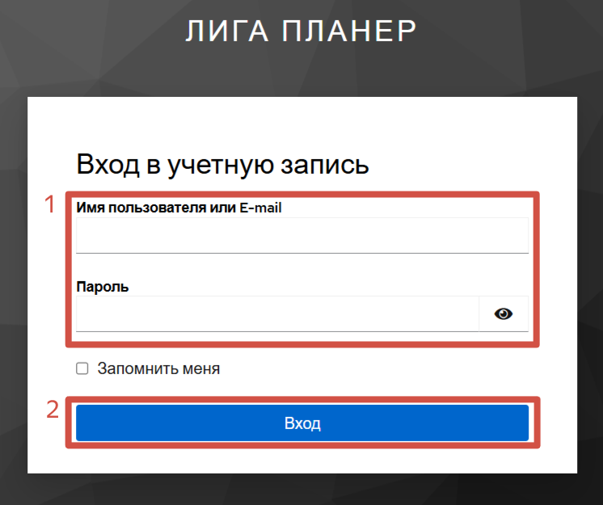

Figure 1 Рис. Вход в систему

Необходимо ввести логин и пароль пользователя, нажать кнопку «Вход».

После входа в систему пользователю открывается экран «Список сотрудников»

#### Страница списка

Описание

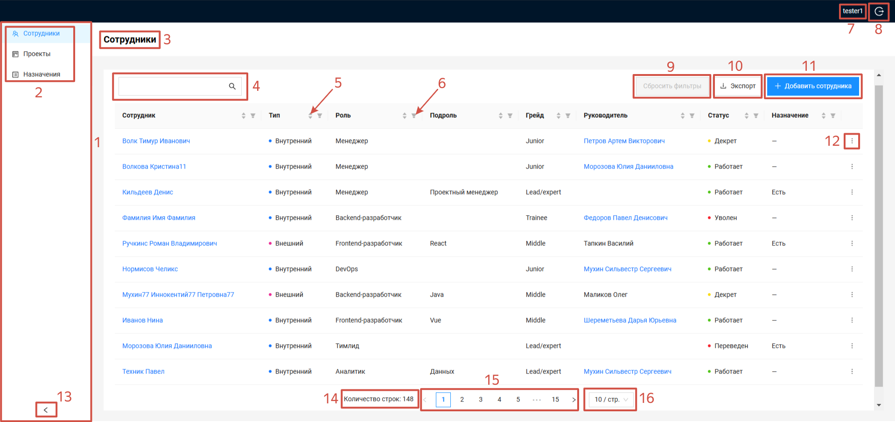

| № | Название | Описание |
| --- | --- | --- |
| **1** | Боковое меню | Позволяет осуществлять навигацию по разделам |
| **2** | Разделы | Включает в себя разделы: Сотрудники, Проекты, Назначения. По нажатию происходит переход на соответствующую страницу |
| **3** | Наименование раздела | Отображает название открытого раздела |
| **4** | Строка поиска | Используется для сквозного поиска по заданному значению из списка |
| **5** | Фильтрация | Используется для фильтрации значений в столбце |
| **6** | Сортировка | Используется для сортировки значений в столбце |
| **7** | Логин пользователя | Отображает логин, под которым пользователь зашел в систему |
| **8** | Кнопка выхода из системы | По нажатию происходит выход из системы и возврат на страницу входа |
| **9** | Кнопка сброса фильтров | Становится доступной, когда активна фильтрация, и позволяет по нажатию сбросить все активные фильтрации |
| **10** | Кнопка экспорта | По нажатию скачивает всю информацию по текущему разделу в формате Excel файла |
| **11** | Кнопка создания | По нажатию открывает форму для создания новой карточки в текущем разделе |
| **12** | Функциональное меню | По наведению показывает меню действий с соответствующим объектом |
| **13** | Свернуть боковое меню | Позволяет свернуть боковое меню в более компактный вид |
| **14** | Счетчик строк | Отображает общее количество строк в текущем разделе |
| **15** | Навигация | Позволяет перемещаться по страницам раздела |
| **16** | Переключатель отображения строк | Позволяет изменять количество отображаемых строк на странице |

#### Просмотр истории изменений

Описание

Для того, чтобы открыть историю изменений сотрудника/проекта/назначения необходимо открыть карточку сотрудника/проекта/назначения.

В карточке слева снизу расположена кнопка "История изменений" (), при нажатии на кнопку открывается история изменений.

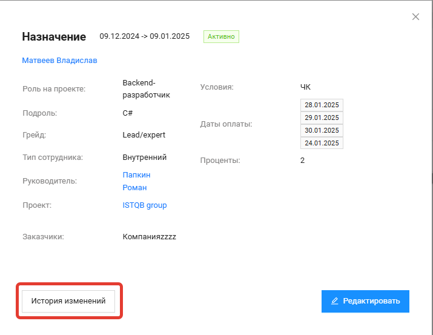

Figure 2 Рис. Просмотр истории изменений

В открывшемся окне отображается следующее ():

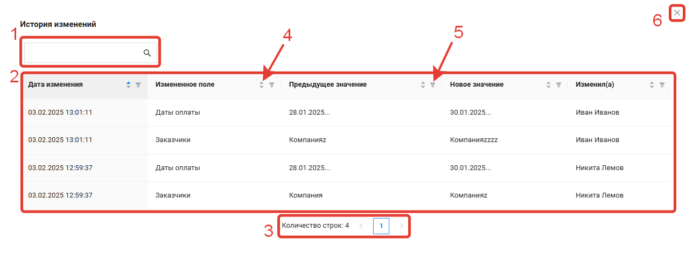

Figure 3 Рис. История изменений

Строка поиска (1) - используется для сквозного поиска по заданному значению из списка.

Информация по истории изменений (2):

Дата изменения - дата и время, когда происходили изменения.

Измененное поле - какое поле изменяли в карточке.

Предыдущее значение - значение изменяемого поля, которое было установлено до изменения; если в поле в конце указано "...", то при наведении отображаются все значения.

Новое значение - новое значение изменяемого поля; если в поле в конце указано "...", то при наведении отображаются все значения.

Изменил(а) - кто вносил изменения (Фамилия и имя сотрудника).

Счетчик строк и навигация (3) - отображает общее количество строк в списке, позволяет перемещаться по страницам списка.

Сортировка (4) - используется для сортировки значений в столбце.

Фильтрация (5) - используется для фильтрации значений в столбце.

По кнопке (6) можно закрыть историю изменений.

#### Выход из системы

Описание

Для выхода из системы необходимо в правом верхнем углу нажать на кнопку выхода из системы. ()

Figure 4 Рис. Выход из системы

### Работа с сотрудниками

#### Создание сотрудника

Описание

Для создания новой карточки сотрудника необходимо нажать на кнопку **"Добавить сотрудника"** (Рис. Кнопка добавить сотрудника) в верхнем правом углу на странице списка сотрудников:

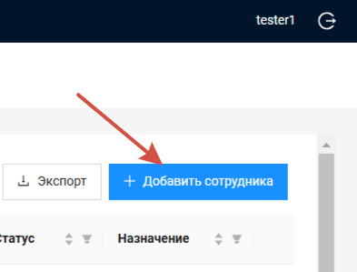

Figure 5 Рис. Кнопка добавить сотрудника

По умолчанию после нажатия на кнопку открывается карточка создания **внутреннего** сотрудника.

Если необходимо создать **внешнего **сотрудника, то в поле "Тип сотрудника" нужно выбрать из выпадающего списка значение "Внешний" (Рис. Выбор типа сотрудника):

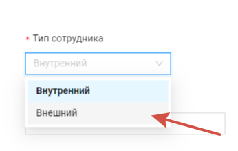

Figure 6 Рис. Выбор типа сотрудника

##### Создание внутреннего сотрудника

Описание

В открывшемся окне (Рис. Создание внутреннего сотрудника) необходимо заполнить следующие поля:

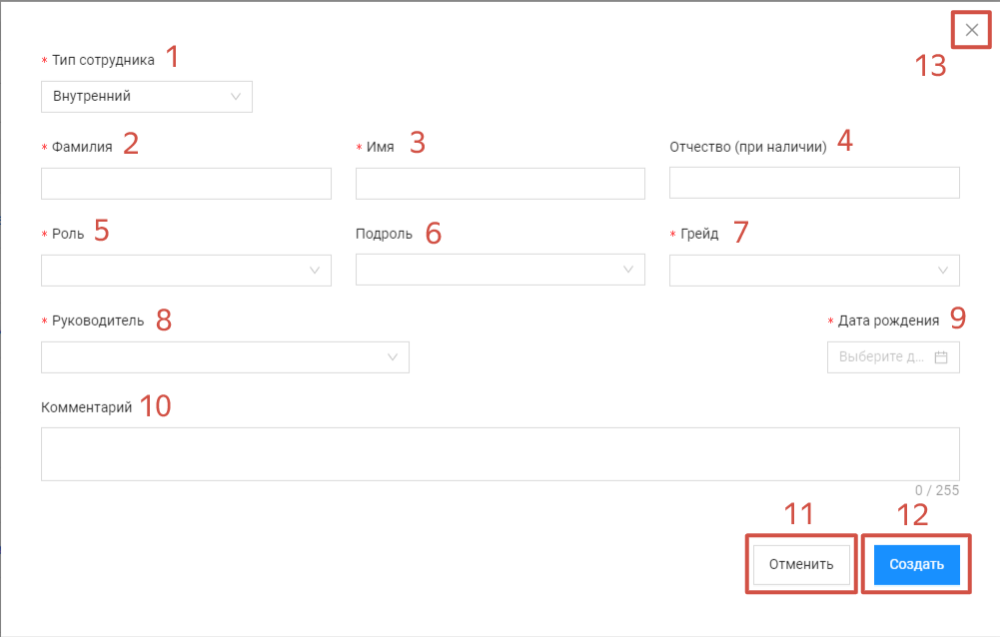

Figure 7 Рис. Создание внутреннего сотрудника

"Тип сотрудника"** (1)** - выпадающий список с выбором типа сотрудника, позволяет переключить карточку создания с внутреннего сотрудника на внешнего и обратно. Значение "Внутренний" выставлено по умолчанию.

"Фамилия"** (2)** - обязательное для заполнения. Поле для свободного ввода фамилии сотрудника.

"Имя"** (3)** - обязательное для заполнения. Поле для свободного ввода имени сотрудника.

"Отчество (при наличии)"** (4)** - поле для свободного ввода отчества сотрудника. Допускается оставлять поле пустым.

"Роль" **(5)** - обязательное для заполнения. Выпадающий список с выбором роли сотрудника.

"Подроль" **(6)** - выпадающий список с выбором соответствующей подроли для выбранной роли сотрудника. Допускается оставлять поле пустым.

"Грейд" **(7)** - обязательное для заполнения. Выпадающий список с выбором грейда сотрудника.

"Руководитель" **(8)** - обязательное для заполнения (кроме сотрудников с ролью Тимлид или Менеджер, для них допускается оставлять поле пустым). В списке показаны и доступны для выбора сотрудники с ролью Тимлид или Менеджер.

"Дата рождения" **(9)** - обязательное для заполнения. Поле с календарем, позволяет выбрать день и месяц рождения сотрудника. Год рождения не указывается.

"Комментарий" **(10)** - поле для свободного ввода дополнительной информации о сотруднике. Допускается оставлять поле пустым.

После заполнения всех нужных и обязательных полей необходимо нажать на кнопку **"Создать"** (№12 Рис. Создание внутреннего сотрудника) для создания новой карточки сотрудника.

Для отмены создания можно нажать на кнопку **"Отменить"** (№11 Рис. Создание внутреннего сотрудника), нажать на **крестик** (№13 Рис. Создание внутреннего сотрудника) или нажать на клавиатуре на клавишу **esc**.

##### Создание внешнего сотрудника

Описание

После открытия окна и выбора значения типа сотрудника "Внешний" (Рис. Создание внешнего сотрудника) необходимо заполнить следующие поля:

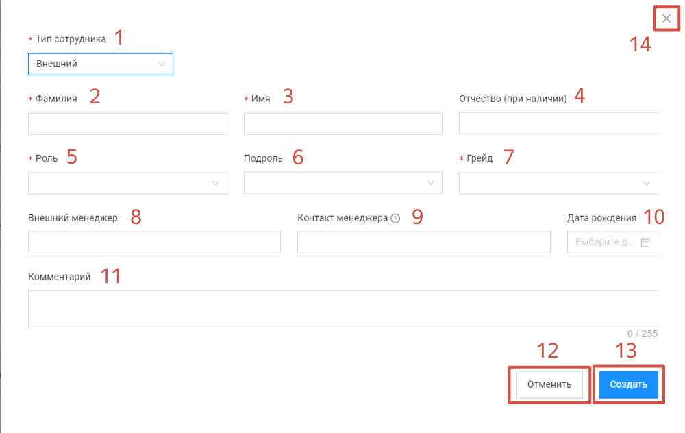

Figure 8 Рис. Создание внешнего сотрудника

"Тип сотрудника"** (1)** - выпадающий список с выбором типа сотрудника, позволяет переключить карточку создания с внешнего сотрудника на внутреннего и обратно. Значение "Внутренний" выставлено по умолчанию.

"Фамилия"** (2)** - обязательное для заполнения. Поле для свободного ввода фамилии сотрудника.

"Имя"** (3)** - обязательное для заполнения. Поле для свободного ввода имени сотрудника.

"Отчество (при наличии)"** (4)** - поле для свободного ввода отчества сотрудника. Допускается оставлять поле пустым.

"Роль" **(5)** - обязательное для заполнения. Выпадающий список с выбором роли сотрудника.

"Подроль" **(6)** - выпадающий список с выбором соответствующей подроли для выбранной роли сотрудника. Допускается оставлять поле пустым.

"Грейд" **(7)** - обязательное для заполнения. Выпадающий список с выбором грейда сотрудника.

"Внешний менеджер" **(8)** - поле для свободного ввода информации о внешнем менеджере сотрудника, например, фамилия и имя менеджера сторонней компании, с которым происходит взаимодействие по данному сотруднику. Допускается оставлять поле пустым.

"Контакт менеджера" **(9)** - поле для ввода контактной информации внешнего менеджера сотрудника. В качестве контактной информации необходимо указать либо имя Telegram (например, @login_123), либо номер телефона, начинающийся с 8 или +. Допускается оставлять поле пустым.

"Дата рождения" **(10)** - поле с календарем, позволяет выбрать день и месяц рождения сотрудника. Год рождения не указывается. Допускается оставлять поле пустым.

"Комментарий" **(11)** - поле для свободного ввода дополнительной информации о сотруднике. Допускается оставлять поле пустым.

После заполнения всех нужных и обязательных полей необходимо нажать на кнопку **"Создать"** (№13 Рис. Создание внешнего сотрудника) для создания новой карточки сотрудника.

Для отмены создания можно нажать на кнопку **"Отменить"** (№12 Рис. Создание внешнего сотрудника), нажать на **крестик** (№14 Рис. Создание внешнего сотрудника) или нажать на клавиатуре на клавишу **esc**.

#### Редактирование сотрудника

Описание

Для внесения изменений в карточку сотрудника необходимо перейти в редактирование карточки. Это можно сделать следующими способами:

В карточке сотрудника необходимо нажать на кнопку **"Редактировать"** (Рис. Кнопка редактирования) в нижнем правом углу

На странице списка сотрудников напротив записи интересующего сотрудника в функциональном меню выбрать действие **"Редактировать"** (Рис. Редактирование через функциональное меню)

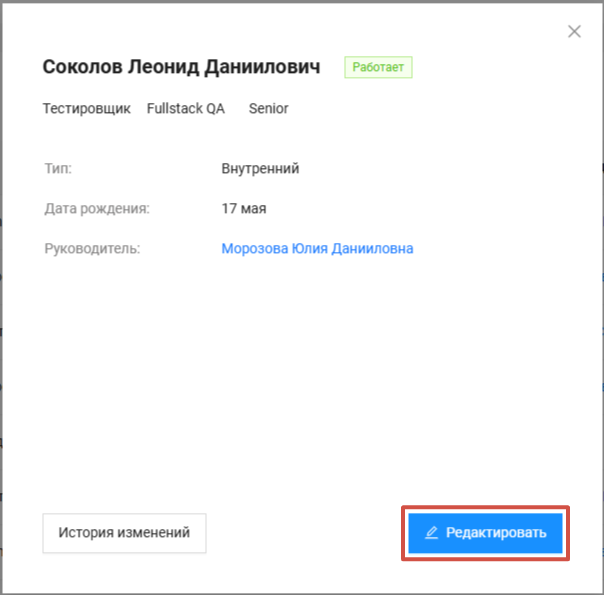

Figure 9 Рис. Кнопка редактирования

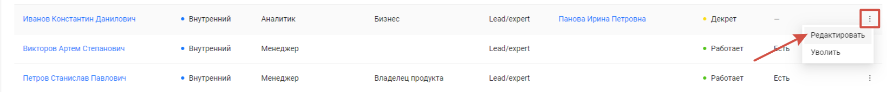

Figure 10 Рис. Редактирование через функциональное меню

В открывшемся окне (Рис. Редактирование сотрудника) внести необходимые изменения:

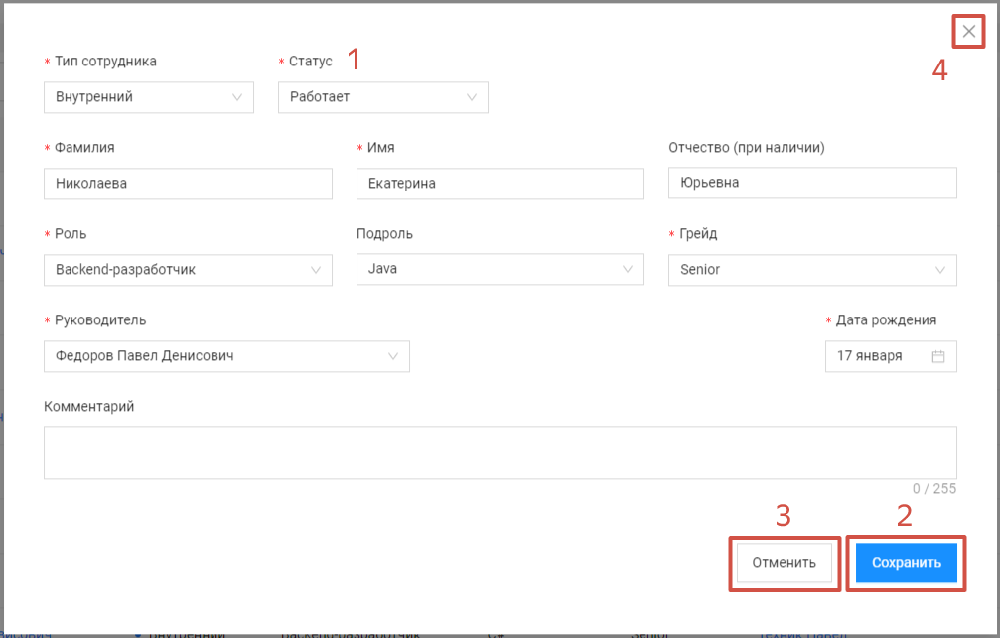

Figure 11 Рис. Редактирование сотрудника

"Статус" **(1)** - выпадающий список с выбором статуса, позволяет изменить статус сотрудника. Значение "Работает" проставляется автоматически при создании сотрудника.

Остальные поля аналогичны полям в карточке создания сотрудника.

После внесения всех нужных изменений необходимо нажать на кнопку **"Сохранить"** (№2 Рис. Редактирование сотрудника) для сохранения внесенных изменений в карточку сотрудника.

Для отмены редактирования можно нажать на кнопку **"Отменить"** (№3 Рис. Редактирование сотрудника), нажать на **крестик** (№4 Рис. Редактирование сотрудника) или нажать на клавиатуре на клавишу **esc**.

| **Сотруднику, имеющему активное назначение, нельзя изменить статус на "Уволен"** |
| --- |

##### Увольнение сотрудника через функциональное меню

Возможно изменить статус сотрудника на "Уволен" не только через редактирование карточки сотрудника, но и через функциональное меню, выбрав действие **"Уволить"** (Рис. Увольнение через функциональное меню):

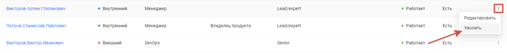

Figure 12 Рис. Увольнение через функциональное меню

### Работа с проектами

#### Создание проекта

Описание

Для заведения проекта в системе пользователю необходимо перейти на вкладку «Проекты» в боковом меню (п. на Рис.  Список проектов). На экране отображается список всех проектов (п.1  на Рис.  Список проектов)

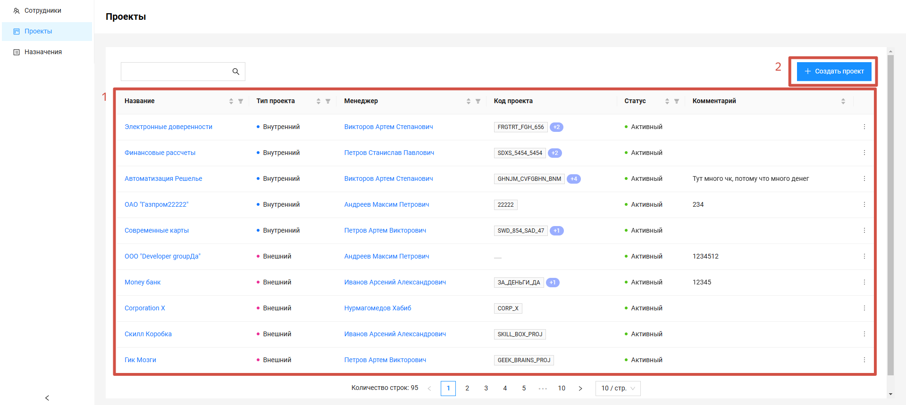

Figure 13 Рис. Список проектов

Для того, чтобы создать новый проект необходимо нажать кнопку "Создать проект"   (п.2 на Рис.  Список проектов). На открывшемся окне (Рис.  Создание проекта) заполнить следующие поля:

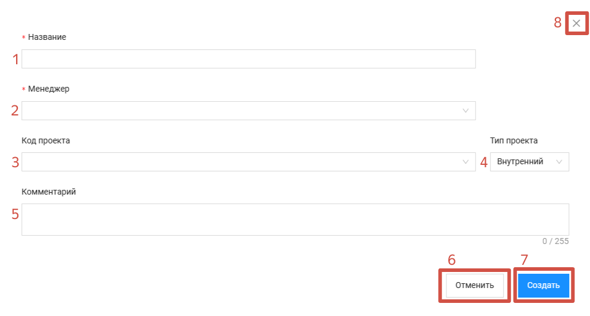

Figure 14 Рис. Создание проекта

Название - обязательное поле, поле свободного ввода, предназначено для ввода названия проекта. Должно быть уникальным и отличаться от предыдущих. (п.1 Рис.  Создание проекта)

Менеджер -  обязательное поле, при нажатии на поле открывается выпадающий список, из которого необходимо выбрать сотрудника с ролью менеджер. (п.2 Рис.  Создание проекта)

Код проекта - поле свободного ввода, можно ввести несколько ЧК проекта. Для добавления нового значения в поле необходимо ввести название ЧК и нажать Enter. (п.3 Рис.  Создание проекта)

Тип проекта - по умолчанию: внутренний. (п.4 Рис.  Создание проекта)

Комментарий - поле свободного ввода, предназначено для ввода дополнительной информации (п.5 Рис.  Создание проекта)

По кнопке «Создать» (п.7 на Рис.  Создание проекта) Создается новая запись проекта в списке. (п.1  на Рис.  Список проектов)

По кнопке «Отменить» (п.6 на Рис.  Создание проекта) и кнопке (8) отменяется создание проекта и форма закрывается без сохранения.

#### Просмотр карточки проекта

Описание

Для просмотра подробной информации о проекте необходимо открыть карточку проекта. Для этого необходимо в Списке проектов ( ) найти запись с интересующим проектом и двойным нажатием левой кнопкой мыши кликнуть на ней.

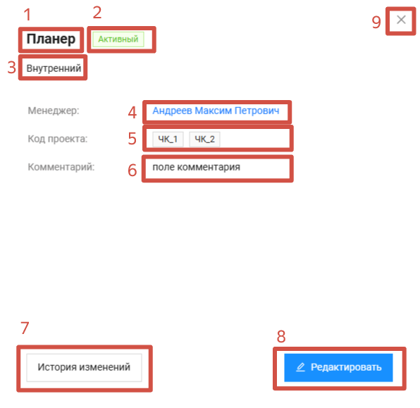

Figure 15 Рис. Карточка проекта

Карточка содержит следующую информацию:

Название проекта;

Статус;

Тип проекта;

ФИО менеджера проекта;

Перечень кодов проекта (при наличии);

Текст Комментария (при наличии).

Кнопка "История изменений" - при нажатии открывается история изменений проекта.

Кнопка "Редактировать" - при нажатии открывается окно редактирования проекта.

Кнопка "Крестик" - при нажатии карточка проекта закрывается.

#### Редактирование проекта

Описание

Для изменения информации о проекте необходимо перейти в редактирование карточки. Это можно сделать следующими способами:

В карточке проекта нажать кнопку "Редактировать". ()

В списке проектов напротив записи интересующего проекта в функциональном меню выбрать пункт "Редактировать". ()

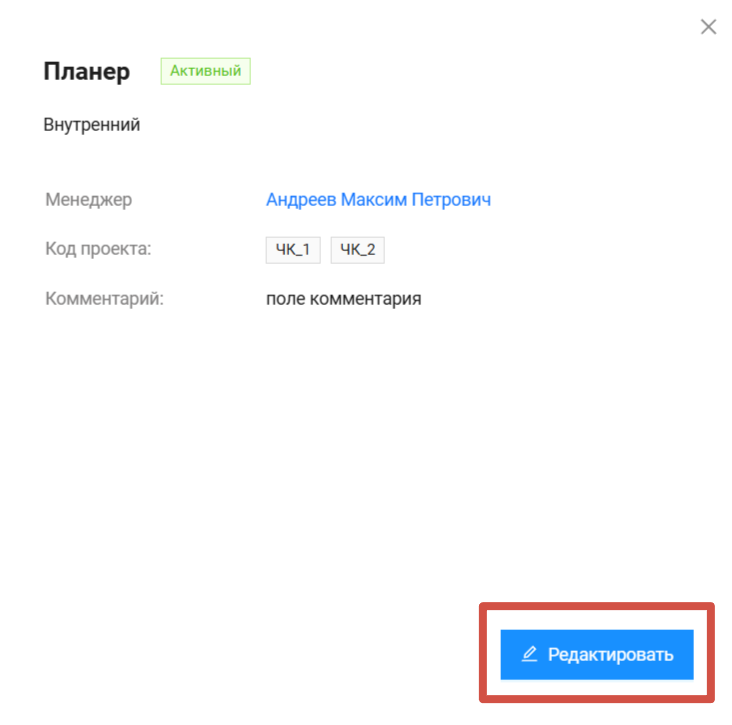

Figure 16 Рис. Редактирование в карточке проекта

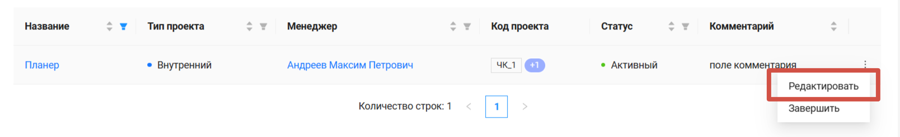

Figure 17 Редактирование в  функциональном меню

В открывшемся окне ( Рис. Редактирование проекта) необходимо внести изменения:

Статус -  обязательное поле, при нажатии на поле открывается выпадающий список, из которого необходимо выбрать подходящий статус.  (п. 1 Рис. Редактирование с)

Остальные поля аналогичны полям при создании проекта.

Для того, чтобы сохранить изменения необходимо нажать кнопку "Сохранить" (п. 2 Рис. Редактирование проекта) . Остальные Кнопки аналогичны кнопкам при создании проекта.

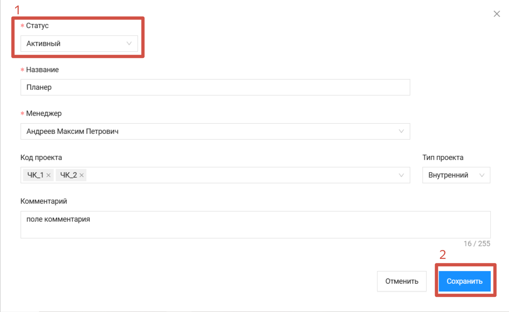

Figure 18 Рис. Редактирование проекта

Необходимо внести изменения в поля и нажать кнопку "Сохранить" (п.8 Рис. Редактирование проекта).

#### Завершение проекта

Описание

Завершить проект можно двумя способами:

В карточке редактирования проекта в поле "Статус"- выбрать значения "Завершен" и сохранить изменения.  ()

В списке проектов напротив записи интересующего проекта в функциональном меню выбрать пункт "Завершить". ()

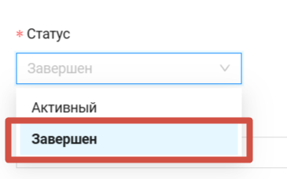

Figure 19 Завершение через карточку проекта

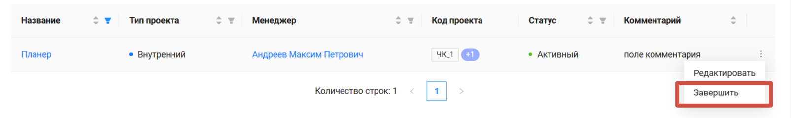

Figure 20 Завершение через  функциональное меню

| **Проект, имеющий активное назначение, нельзя перевести в статус на "Завершить"** |
| --- |

### Работа с назначениями

#### Просмотр списка назначений

Описание

При переходе в раздел "**Назначения**" через боковое меню открывается страниц просмотра списка назначений ().

На данной странице расположена кнопка для создания назначения - "Добавить" (1).

Список включает в себя следующие столбцы:

"Сотрудник" - отображает ФИ сотрудника, при нажатии на сотрудника открывается карточка сотрудника.

"Роль" - отображает роль сотрудника на проекте.

"Подроль" - отображает подроль сотрудника на проекте..

"Тип" - отображает тип сотрудника (из карточки сотрудника).

"Руководитель" - отображает руководителя сотрудника (из карточки сотрудника):
Если сотрудник с типом "**Внутренний**", то отображается ФИ руководителя, при нажатии на руководителя открывается карточка руководителя.
Если сотрудник с типом "**Внешний**", то отображается внешний менеджер.

"Проект" - отображает проект, при нажатии на проект открывается карточка проекта.

"Заказчики" - отображает заказчиков.

"Дата подключения" - отображает дату подключения сотрудника на проект.

"Дата отключения" - отображает дату отключения сотрудника с проекта.

"Условия" - отображает условие подключения сотрудника на проект.

"Ставка без НДС., руб . в час" - отображает ставку сотрудника на проекте.

"Проценты" - отображает проценты по подключению сотрудника на проект.

"Даты оплаты" () - отображает даты оплаты, в списке отображается самая **ближайшая следующая дата оплаты** (если все даты оплаты прошли, то отображает последнюю), при наведении на дату оплаты отображаются все даты оплаты, а следующая дата оплаты подсвечивается.

"Статус" - отображает статус назначения.

Так как таблица обширная, внизу расположена полоса прокрутки (2).

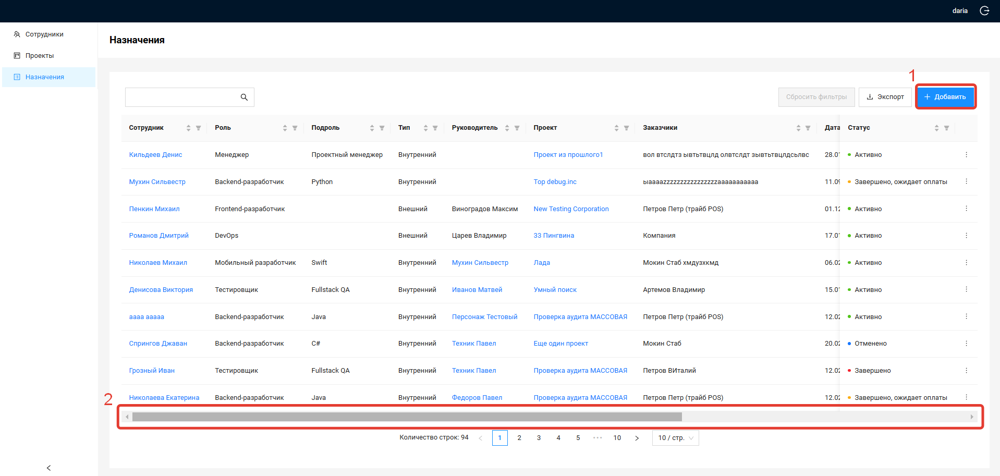

Figure 21 Рис. Список назначений

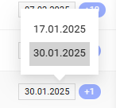

Figure 22 Рис. Даты оплаты

#### Создание назначения

Описание

Для того, чтобы создать новое назначение необходимо нажать кнопку "**Добавить**" ().

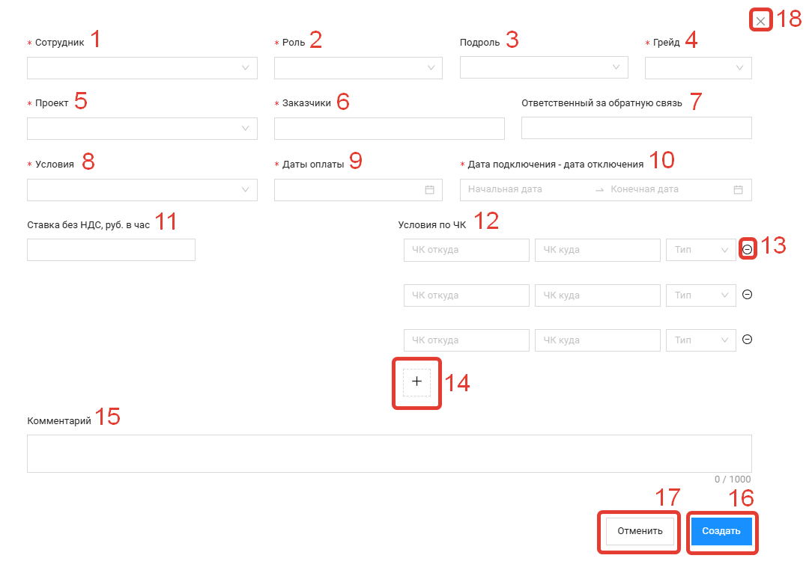

Figure 23 Рис. Создание назначения

На открывшемся окне () необходимо заполнить следующие поля:

"Сотрудник" (1) - обязательное поле, при нажатии на поле открывается выпадающий список, из которого необходимо выбрать сотрудника, который назначается на проект. Доступен поиск по сотрудникам, для этого необходимо ввести первые буквы фамилии/имени. В списке отображаются сотрудники со статусом "Работает".

"Роль" (2) - обязательное поле, после выбора сотрудника из его карточки автоматически заполняется данное поле. Имеется возможность поменять роль, при нажатии на поле открывается выпадающий список со всеми ролями.

"Подроль" (3) - данное поле недоступно, если выбрана роль, у которой нет подролей; после выбора сотрудника из его карточки автоматически заполняется данное поле. Имеется возможность поменять подроль, при нажатии на поле открывается выпадающий список с соответствующими для выбранной роли подролями.

"Грейд" (4) - обязательное поле, после выбора сотрудника из его карточки автоматически заполняется данное поле. Имеется возможность поменять грейд, при нажатии на поле открывается выпадающий список грейдов.

"Проект" (5) - обязательное поле, при нажатии на поле открывается выпадающий список с названиями проектов, имеющих статус "Активный". Доступен поиск по проектам, для этого необходимо ввести первые буквы названия проекта.

"Заказчики" (6) - обязательное поле, поле свободного ввода.

"Ответственный за обратную связь" (7) - поле свободного ввода, предназначено для ввода ответственного за обратную связь сотрудника, назначающегося на проект.

"Условия" (8) - обязательное поле, при нажатии на поле открывается выпадающий список с условиями подключения на проект.

"Даты оплаты" (9) - обязательное поле, при нажатии на поле открывается календарь: нажав на определенное число, оно добавляется в поле. Можно убирать и менять даты в календаре, либо нажать на крестик рядом с датой, чтобы убрать выбранную дату, либо навести на значок календаря в поле: отобразится крестик, нажав на него, все даты в поле очистятся. Максимум можно выбрать 20 дат.

"Дата подключения - дата отключения" (10) - обязательное поле, при нажатии на поле открывается календарь: в левой части календаря выбирается дата подключения, в правой - дата отключения. Можно менять даты в календаре, либо навести на значок календаря в поле: отобразится крестик, нажав на него, все даты в поле очистятся.

"Ставка без НДС., руб. в час/Проценты" (11) - доступен ввод цифрами, при выборе "Условия" (8) отображается необходимое поле: Если выбраны условия "Профитшеринг"/"Ставка", то в данном поле происходит ввод ставки без НДС., руб . в час; если выбрано условие "ЧК", то происходит ввод процентов.

"Условия по ЧК" (12) - ввод состоит из трёх обязательных полей: ЧК откуда (свободный ввод), ЧК куда (свободный ввод), тип (Доход/Расход).
Любую строку можно удалить, для этого необходимо нажать на кнопку (13).
Можно добавить строки, для этого необходимо нажать на кнопку (14).

"Комментарий" (15) - поле свободного ввода.

По кнопке "Создать" (16) создается новая запись назначения.
По кнопке "Отменить" (17) и кнопке (18) отменяется создание назначения и форма закрывается.

| **Если у сотрудника, которого необходимо назначить на проект, уже имеется активное назначение, то перед созданием отобразиться уведомлением с выбором действий.** |
| --- |

##### Создание назначения внешнего сотрудника

Если выбран сотрудник с типом "**Внешний**", то добавляются поля для заполнения ():

"Партнер" (1) - поле свободного ввода.

"Ставка у партнера" (2) - доступен ввод цифрами.

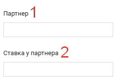

Figure 24 Рис. Создание назначения внешнего сотрудника

#### Просмотр карточки назначения

Описание

Для того, чтобы открыть карточку назначения необходимо на странице списка назначений двойным нажатием левой кнопки мыши кликнуть на строку с интересуемым назначением.

На карточке расположены:

Дата подключения и дата отключения (1)

Статус назначения (2)

ФИ сотрудника с возможностью открыть карточку сотрудника (3)

Данные по назначению (4):

Роль на проекте

Подроль на проекте(при наличии)

Грейд на проекте

Тип сотрудника

Руководитель сотрудника (Если сотрудник внутренний, то при нажатии открывается карточка руководителя; если сотрудник внешний отображается внешний менеджер)

Название проекта (при нажатии открывается карточка проекта)

Заказчики

Ответственный за обратную связь (при наличии)

Условия подключения

Даты оплаты

Ставка без НДС (при наличии)

Проценты по оплате(при наличии)

Условия по ЧК (при наличии)

Текст комментария (при наличии)

Партнер (при наличии)

Ставка у партнера (при наличии)

Кнопка "История изменений" (5) - при нажатии открывается история изменений назначения.

Кнопка "Редактировать" (6) - при нажатии на кнопку открывается редактирование назначения.

По кнопке (7) можно закрыть карточку назначения.

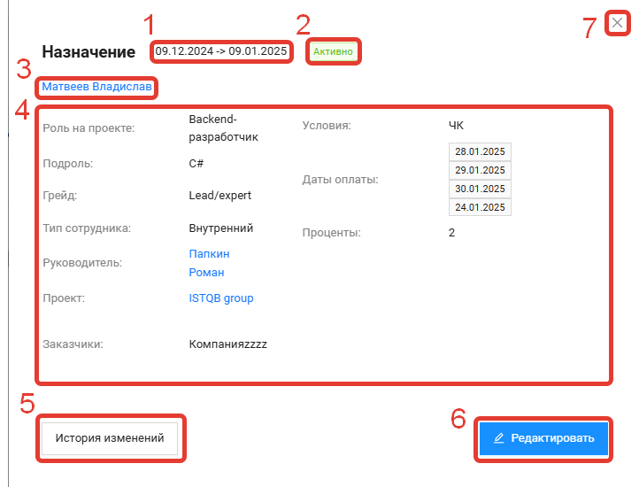

Figure 25 Рис. Карточка назначения

#### Редактирование назначения

Описание

Для изменения информации о назначении необходимо перейти в редактирование карточки назначения. Это можно сделать следующими способами:

В карточке назначения нажать кнопку "**Редактировать**" ().

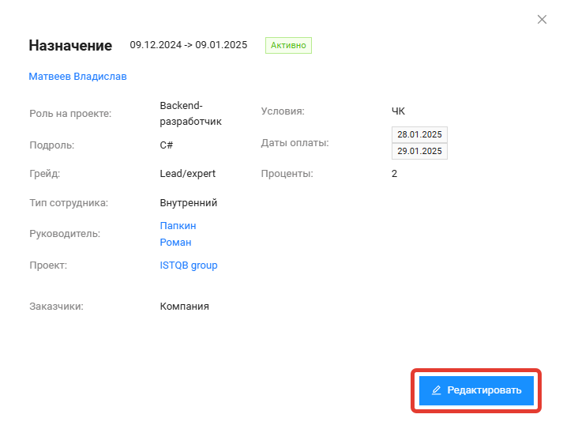

Figure 26 Рис. Редактирование назначения через карточку

В списке назначений напротив записи интересующего назначения в функциональном меню выбрать пункт "**Редактировать**" ().

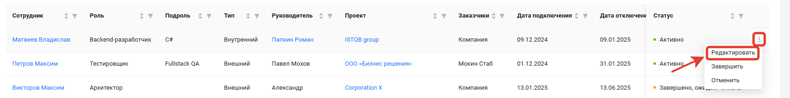

Figure 27 Рис. Редактирование назначения через функциональное меню

В открывшемся окне () необходимо внести изменения:

"Статус": при создании назначения ему присваивается статус "**Активно**", при редактировании можно выбрать необходимый статус из выпадающего списка.

Остальные поля аналогичны полям при создании назначения.

Для того, чтобы сохранить изменения необходимо нажать кнопку "Сохранить" (Кнопки аналогичны кнопкам при создании назначения).

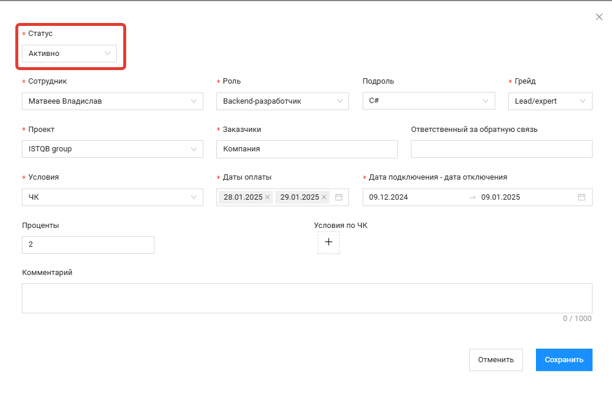

Figure 28 Рис. Редактирование назначения

#### Завершение и отмена назначения

Описание

Для назначений доступны статусы:

"Активно"

"Завершено"

"Завершено, ожидает оплаты"

"Отменено"

Изменить статус можно только **вручную**.

Завершить/Отменить назначение можно двумя способами:

В карточке редактирования назначение в поле "Статус" и сохранить изменения.  ()
Доступны следующие статусы при редактировании:
- Завершено, ожидает оплаты (1)
- Завершено (2)
- Отменено (3)

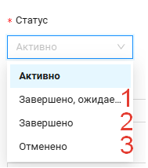

Figure 29 Рис. Завершение/Отмена назначения через редактирование назначения

В списке назначений напротив записи интересующего назначения в функциональном меню выбрать пункт "Завершить" (1)/"Отменить" (2). ()
При нажатии на "Завершить" (1) открывается окно с выбором статуса завершения ():
Необходимо выбрать из выпадающего списка статус и нажать кнопку "Да".
При нажатии на кнопку "Отмена" окно закрывается, завершение назначения останавливается.

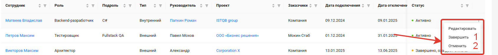

Figure 30 Рис. Завершение/Отмена назначения через функциональное меню

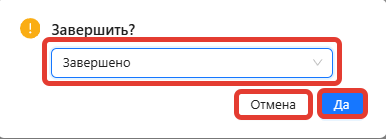

Figure 31 Рис. Завершение назначения

### Работа с вакансиями

#### Создание вакансии

Описание

Для создания новой вакансии в системе пользователю необходимо перейти на вкладку «Вакансии» в боковом меню (п.1 Рис.  Список вакансий). Затем на вкладку "Список вакансий"(п.2  Рис.  Список вакансий). На экране отображается список всех вакансий (п.3  Рис.  Список вакансий).

Необходимо нажать кнопку "**Добавить вакансию**"  (п.4  Рис.  Список вакансий).

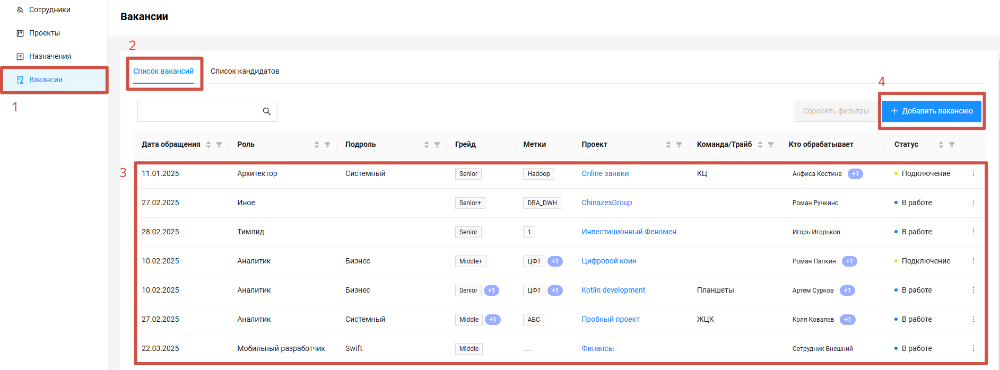

Figure 32 Рис. Список вакансий

На открывшемся окне (Рис.  Создание вакансии) заполнить следующие поля:

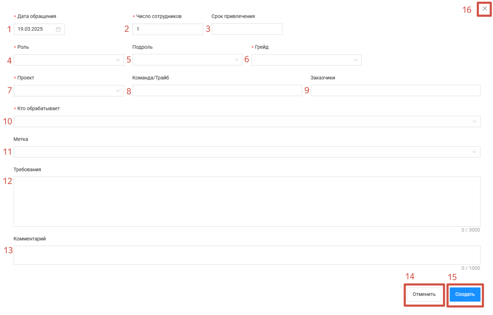

Figure 33 Создание вакансии

Дата обращения - обязательное поле, предзаполнено текущей датой. Для изменения значения необходимо нажать на поле и выбрать нужную дату.

Число сотрудников - обязательное поле, предзаполнено значением 1.  Для изменения значения можно воспользоваться стрелками вверх и вниз в правой части поля или вручную ввести значение.

Срок привлечения - поле свободного ввода, предназначено для ввода срока на который планируется задействовать кандидата на вакансии.

Роль - обязательное поле, при нажатии на поле открывается выпадающий список, из которого необходимо выбрать роль на которую открыта вакансия.

Подроль -  при нажатии на поле опционально открывается выпадающий список, из которого необходимо выбрать подроль на которую открыта вакансия.

Грейд - обязательное поле, при нажатии на поле открывается выпадающий список, из которого необходимо выбрать один или два грейда, на которые  ведется поиск.

Проект - обязательное поле,  при нажатии на поле открывается выпадающий список с названиями проектов. Доступен поиск по проектам, для этого необходимо ввести первые буквы названия проекта.

Команда/Трайб - поле свободного ввода, предназначено для ввода названия команды или трайба для уточнения.

Заказчики - поле свободного ввода, предназначено для ввода ФИО и контактной информации о заказчиках.

Кто обрабатывает - обязательное поле,  при нажатии на поле открывается выпадающий список, из которого необходимо выбрать от одного до трех сотрудников, которые работают с данной вакансией.

Метка - поле свободного ввода. Для добавления нового значения в поле необходимо ввести название метки и нажать Enter. Максимальное количество меток - 5.

Требования - поле свободного ввода, предназначено для ввода перечня требований по вакансии.

Комментарий -  поле свободного ввода, предназначено для ввода дополнительной информации.

По кнопке «Создать» (п.15 на Рис.  Создание вакансии) Создается новая запись вакансии в списке. (п.3  на Рис.  Список вакансий).

По кнопке «Отменить» (п.14 на Рис.  Создание вакансии) и кнопке (16) отменяется создание вакансии и форма закрывается без сохранения.

#### Просмотр карточки вакансии

Описание

Для просмотра подробной информации о вакансии необходимо открыть карточку вакансии. Для этого необходимо в Списке вакансий  (Рис. Карточка вакансии) найти запись с интересующей вакансией и двойным нажатием левой кнопкой мыши кликнуть на ней. (За исключением гиперссылки в столбце "Проект")

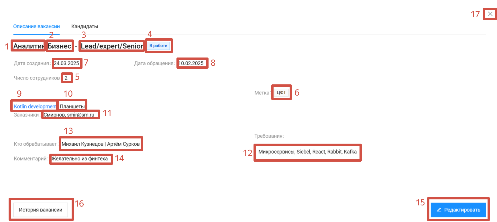

Figure 34 Рис. Карточка вакансии

Карточка содержит следующую информацию:

Роль;

Подроль;

Грейды;

Статус вакансии;

Число сотрудников требуемых на вакансию;

Метки отличающие вакансию от других;

Дата создания вакансии;        +Срок привлечения;

Дата обращения;

Название проекта - при нажатии открывается карточка проекта;

Название команды/трайба;

Заказчики (ФИО, контактная информация);

Требования;

Кто обрабатывает;

Комментарий;

Кнопка "Редактировать" - при нажатии открывается окно редактирования вакансии;

Кнопка "История вакансии" - при нажатии открывается окно  с историей изменения вакансии;

Кнопка "Крестик" - при нажатии карточка вакансии закрывается.

#### Редактирование вакансии

Описание

Для изменения информации о вакансии необходимо перейти в редактирование карточки. Это можно сделать следующими способами:

В карточке вакансии нажать кнопку "Редактировать". (п.15 Рис. Карточка вакансии).

В списке вакансий напротив записи интересующей вакансии в функциональном меню выбрать пункт "Редактировать". (Рис. Редактирование в функциональном меню)

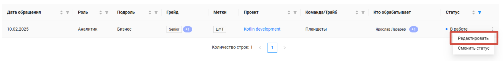

Figure 35 Рис. Редактирование в функциональном меню

В открывшемся окне ( Рис. Редактирование вакансии) необходимо внести изменения:

Статус -  обязательное поле, при нажатии на поле открывается выпадающий список, из которого необходимо выбрать подходящий статус.  (п. 1 Рис. Редактирование вакансии)

Остальные поля аналогичны полям при создании вакансии.

Для того, чтобы сохранить изменения необходимо нажать кнопку "Сохранить" (п. 2 Рис. Редактирование вакансии) . Остальные Кнопки аналогичны кнопкам при создании вакансии.

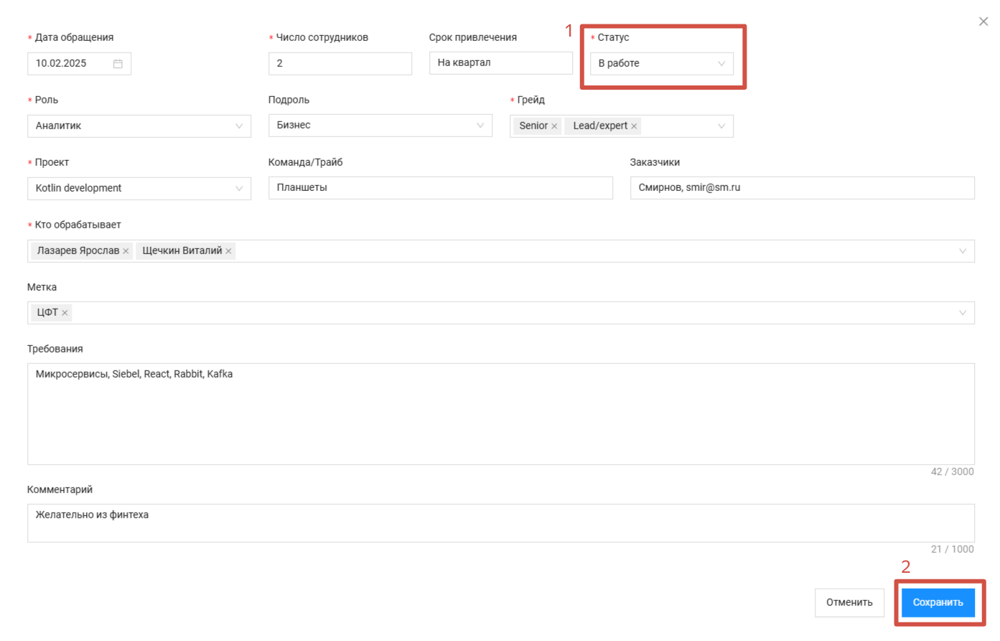

Figure 36 Рис. Редактирование вакансии

### Работа с кандидатами

#### Создание кандидата

Описание

Создание кандидата доступно для определенной вакансии. Для создания кандидата необходимо открыть карточку вакансии () и нажать кнопку "Добавить кандидата".

На открывшемся окне () заполнить следующие поля:

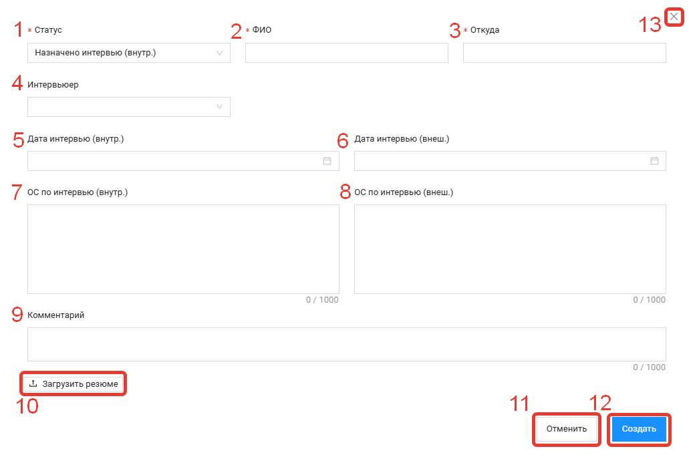

Figure 37 Рис. Создание кандидата

Статус - обязательное поле, предзаполнено статусом "Назначено интервью (внутр.)". Для изменения значения необходимо нажать на поле и выбрать необходимый статус.

ФИО - обязательное поле, поле свободного ввода, предназначено для ввода ФИО кандидата.

Откуда - обязательное поле, поле свободного ввода, предназначено для ввода информации откуда предложен кандидат. При нажатии на поле отображаются подсказки для быстрого заполнения поля.

Интервьюер - при нажатии на поле открывается выпадающий список, из которого необходимо выбрать сотрудников, которые проводят интервью. Можно выбрать максимум 3 интервьюера.

Дата интервью (внутр.) - при нажатии на поле открывается календарь: нажав на определенное число, оно добавляется в поле. Максимум можно выбрать 3 даты.

ОС по интервью (внутр.) - поле свободного ввода, предназначено для ввода обратной связи по внутреннему интервью.

Дата интервью (внеш.) - при нажатии на поле открывается календарь: нажав на определенное число, оно добавляется в поле. Максимум можно выбрать 3 даты.

ОС по интервью (внеш.) - поле свободного ввода, предназначено для ввода обратной связи по внешнему интервью.

Комментарий - поле свободного ввода, предназначено для ввода дополнительной информации.

По кнопке «**Загрузить резюме**» (10) выполняется загрузка в систему резюме кандидата:

Необходимо выбрать файл с резюме из проводника.** Файл должен соответствовать следующим требованиям:**

Максимальный размер файла - 10 МБ;

Максимальная длина названия файла - 30 символов;

Допустимые форматы для загрузки: .pdf, .doc, .docx.

Результат загрузки файла отобразится всплывающим уведомлением. При успешной загрузке название файла отобразится ниже кнопки.

Для того, **чтобы удалить файл** необходимо навести курсор на название файла и нажать на кнопку "корзина".

| Система хранит только последний загруженный файл, т.е. при повторной загрузке происходит замена загруженного файла. |
| --- |

По кнопке «**Создать**» (12) создается новая запись кандидата и отображается на списке кандидатов вакансии.

По кнопке «**Отменить**» (11) и кнопке (13) отменяется создание вакансии и форма закрывается без сохранения.

#### Просмотр карточки кандидата

Описание

Для того, чтобы открыть карточку кандидата необходимо на странице списка кандидатов или на списке кандидатов в карточке вакансии двойным нажатием левой кнопки мыши кликнуть на строку с интересуемым кандидатом.

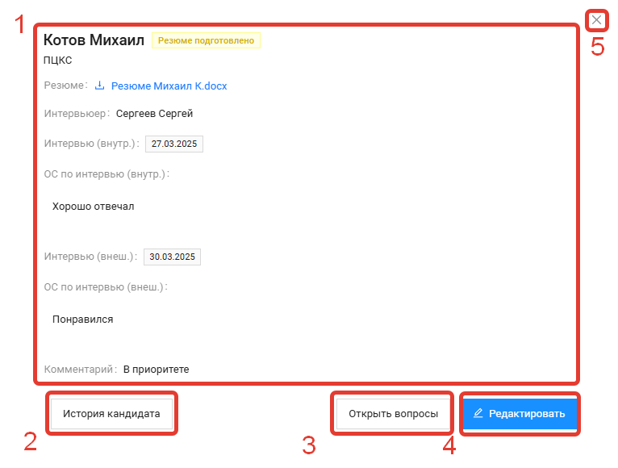

Figure 38 Рис. Карточка кандидата

Карточка содержит следующую информацию:

Информация о кандидате:
- ФИО;
- Статус;
- Резюме (по нажатию на резюме происходит автоматическое скачивание файла);
- Откуда кандидат;
- Интервьюер;
- Даты внутреннего интервью;
- Обратная связь по внутреннему интервью;
- Даты внешнего интервью;
- Обратная связь по внешнему интервью;
- Комментарий.

Кнопка «**История кандидата» **- при нажатии открывается история изменений кандидата.

Кнопка «**Открыть вопросы****»** - при нажатии открывает форму с загрузкой и просмотром вопросов-ответов с интервью ().

Кнопка «**Редактировать****»** - при нажатии открывается окно редактирования кандидата.

Кнопка «**Крестик****»** - при нажатии карточка кандидата закрывается.

#### Импорт файла вопросов-ответов с интервью

Описание

Для каждого кандидата имеется возможность выгрузить файл Excel с вопросами-ответами с интервью. Для этого необходимо на карточке кандидата нажать на кнопку «**Открыть вопросы****»** ().

После нажатия открывается форма с вопросами и ответами на интервью:

По нажатию кнопки «**Загрузить вопросы» **(1)** **открывается форма для загрузки файла ().
Вопросы и ответы отображаются на форме (2) с возможностью скрыть ответ на вопрос, нажав на кнопку (3).
Счетчик строк (4) отображает количество вопросов. Навигация (5) позволяет перемещаться по вопросам.

По кнопке (6) форма просмотра вопросов-ответов с интервью закрывается.

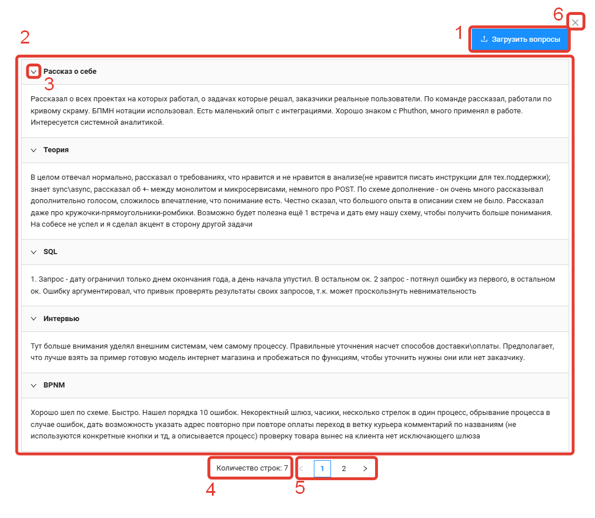

Figure 39 Рис. Форма вопросов-ответов с интервью

После нажатия кнопки «Загрузить вопросы» на открывшемся окне выполняется импорт файла:

По кнопке «**Перетащите или выберите файл****» **(1)** **открывается проводник для выбора файла.

**Требования к файлу Excel:**

Максимальный размер файла - 10 МБ;

Максимальная длина названия файла - 30 символов;

Допустимые форматы для загрузки: .xlsx, .xls;

Файл содержит два столбца: 1 столбец - вопросы, 2 столбец - ответы. В файле должны отсутствовать заголовки (первая строка - первый вопрос и ответ).

После загрузки через проводник название файла отображается на форме (2) с возможностью удалить файл.

По кнопке «**Загрузить****» **(3)** **выполняется импорт файла, отображается уведомление о загрузке и форма закрывается.

По кнопке «**Крестик****»** (4) форма загрузки закрывается.

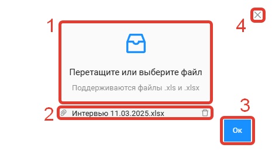

Figure 40 Рис. Загрузка файла

#### Редактирование кандидата

Описание

Для изменения информации о кандидате необходимо перейти в редактирование карточки кандидата. Это можно сделать следующими способами:

В карточке кандидата нажать кнопку «**Редактировать****» **().

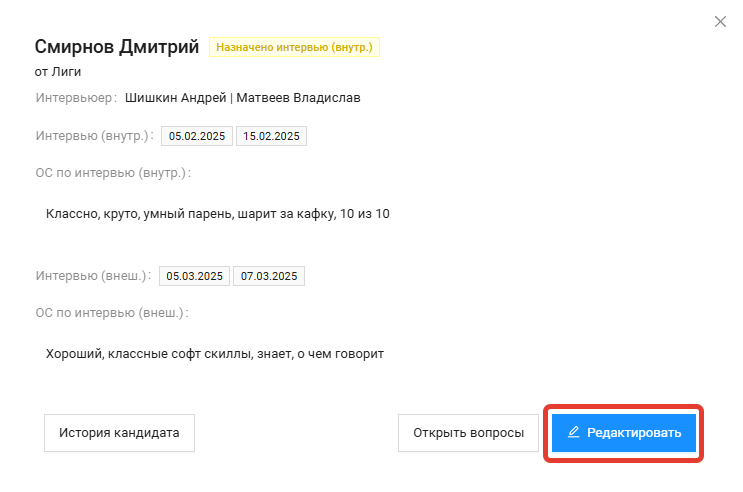

Figure 41 Рис. Редактирование кандидата через карточку

В списке кандидатов напротив записи интересующего кандидата в функциональном меню выбрать пункт «**Редактировать»** ().

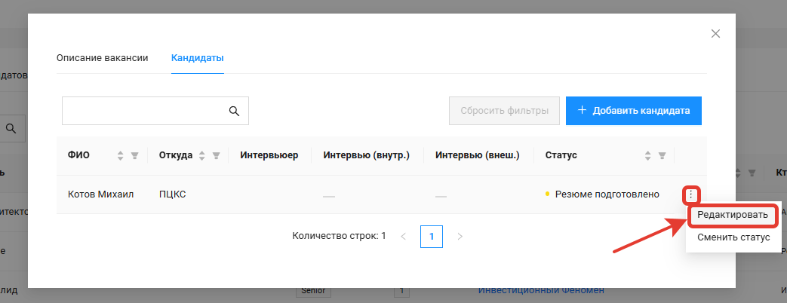

Figure 42 Рис. Редактирование кандидата через функциональное меню

В открывшемся окне необходимо внести изменения. Все поля аналогичны полям при создании кандидата.

Для того, чтобы сохранить изменения необходимо нажать кнопку «**Сохранить****»** (Кнопки аналогичны кнопкам при создании кандидата).

## Приложение

### Уведомления

#### Подключение бота

Описание

Откройте бот в Telegram:

Пройдя по ;

Найдя его с помощью глобального поиска - **@liga_planer_bot**;

С помощью QR-кода ниже:

Нажмите кнопку «СТАРТ» (или введите команду /start), чтобы активировать бота и подключиться к его функционалу.

После приветственного сообщения нажмите кнопку "Начать".

Прочитав авторизационное сообщение, нажмите кнопку "Войти в систему".

Введите имя пользователя (он совпадает с логином УЗ пользователя в корпоративных системах Лиги. Например, anikitenkov).

Введите пароль.

В случае, если данные актуальны, бот отправит сообщение об успешном входе в систему. После авторизации будут доступны уведомления о важных событиях, настроенных в системе, а именно:

Дата подключения на сотрудника к проекту.

Дата отключения сотрудника от проекта.

Дата оплаты.

В случае, если авторизоваться не удалось, проверьте правильность введенных учетных данных и попробуйте снова. В случае дальнейших проблем обратитесь к Администратору.

| Для проверки текущего статуса авторизации в боте введите команду /status. Для выхода из аккаунта введите команду /logout и подтвердите действие нажав кнопку "Да". |
| --- |

## Спецификации экранов (актуальная версия)

Детальное описание элементов интерфейса — в разделе `docs/Спецификации-UI/`:

| Раздел | Спецификации |
| --- | --- |
| Аутентификация | [Экран входа](../Спецификации-UI/Аутентификация/экран-входа.md) |
| Сотрудники | [Список](../Спецификации-UI/Сотрудники/список-сотрудников.md), [Карточка](../Спецификации-UI/Сотрудники/карточка-сотрудника.md), [Создание](../Спецификации-UI/Сотрудники/создание-сотрудника.md), [Редактирование](../Спецификации-UI/Сотрудники/редактирование-сотрудника.md) |
| Проекты | [Список](../Спецификации-UI/Проекты/список-проектов.md), [Создание](../Спецификации-UI/Проекты/создание-проекта.md), [Карточка](../Спецификации-UI/Проекты/карточка-проекта.md), [Редактирование](../Спецификации-UI/Проекты/редактирование-проекта.md) |
| Назначения | [Список](../Спецификации-UI/Назначения/список-назначений.md), [Создание](../Спецификации-UI/Назначения/создание-назначения.md), [Карточка](../Спецификации-UI/Назначения/карточка-назначения.md), [Редактирование](../Спецификации-UI/Назначения/редактирование-назначения.md) |
| Вакансии и кандидаты | [Вакансии](../Спецификации-UI/Вакансии/список-вакансий.md), [Кандидаты](../Спецификации-UI/Кандидаты/список-кандидатов.md) |
